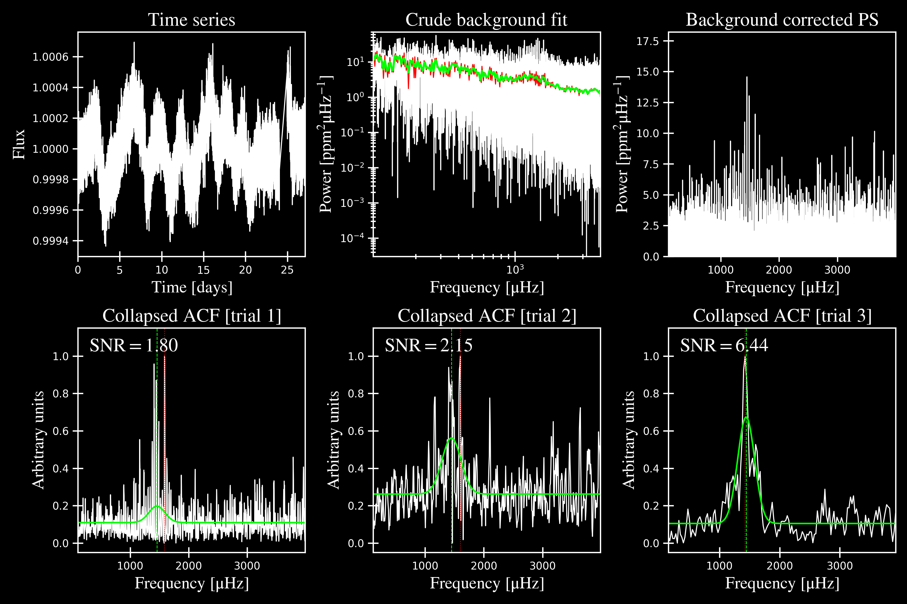
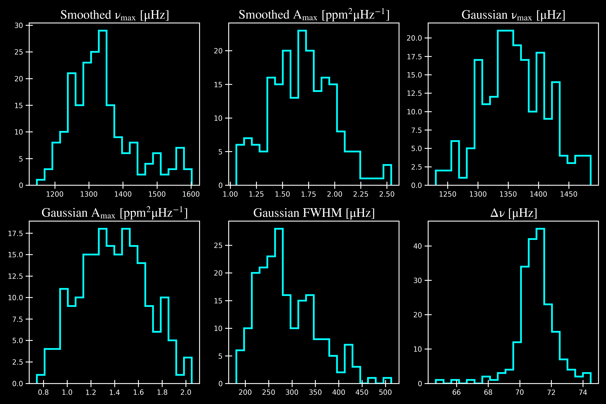
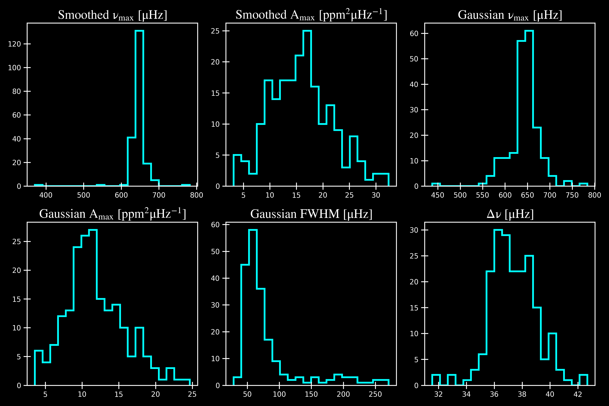
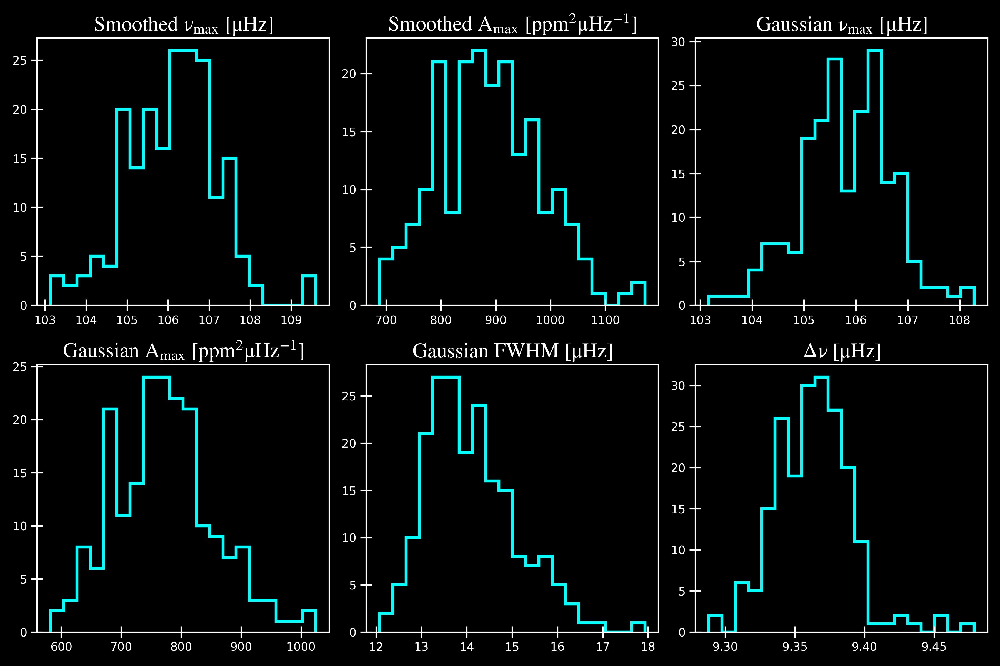

.. _examples:

Examples
========

Single Stars
++++++++++++

KIC 1435467

.. image:: figures/ex1_b.png

KIC 2309595

.. image:: figures/ex2_x.png
.. image:: figures/ex2_b.png

KIC 11618103

.. image:: figures/ex3_x.png
.. image:: figures/ex3_b.png

====================

An Ensemble of Stars
++++++++++++++++++++

If you are running OSX, and want to run an ensemble of stars in parallel, you 
may need to perform some additional installation steps. See ###.