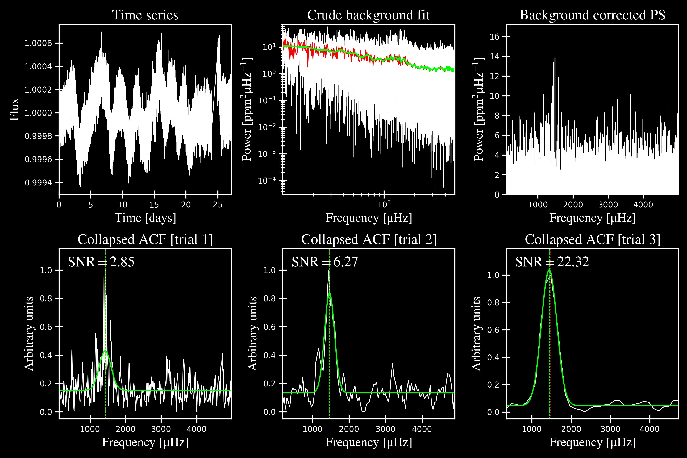
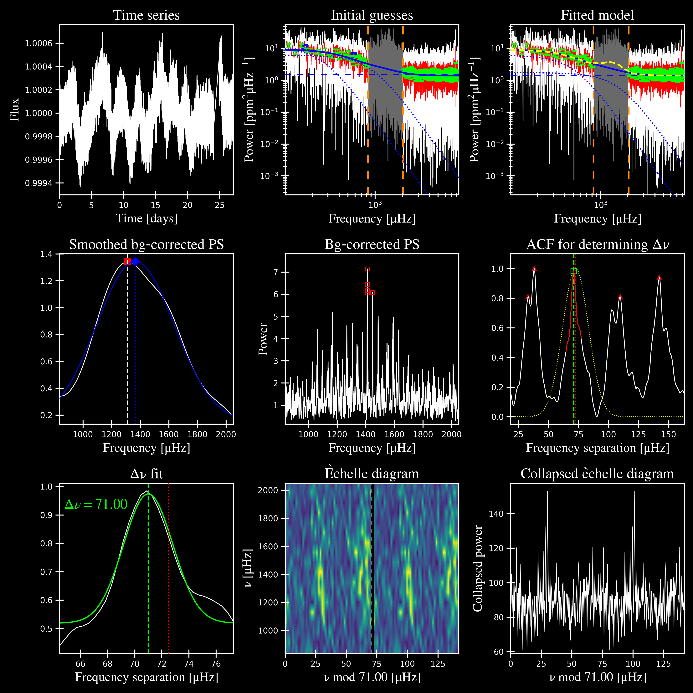
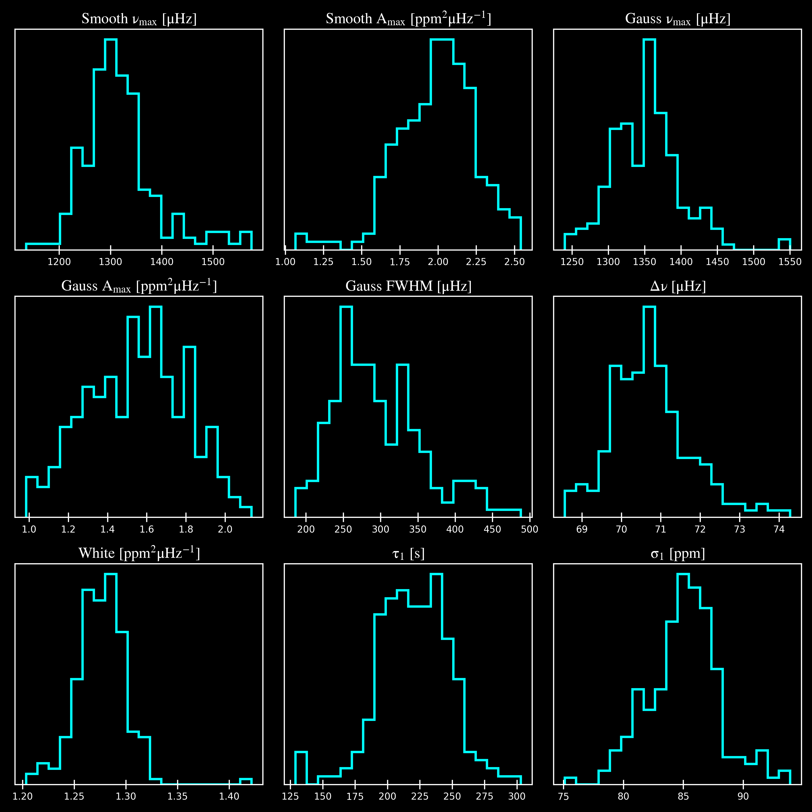
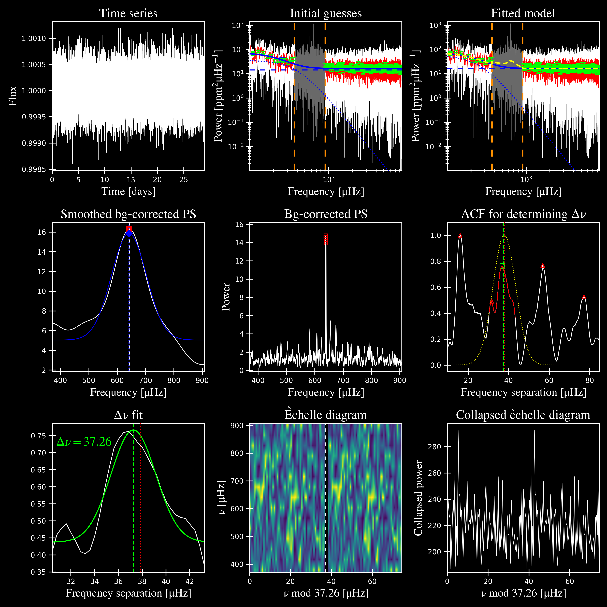

.. _examples:

Examples
########

If ``pysyd setup`` was successfully executed, there should now be light curves and power spectra 
for three KIC stars in the **data/** directory. If so, then you are ready to test out the software!

====================

High SNR Examples
*****************

Below are examples of medium to high signal-to-noise (SNR) detections in three stars of different evolutionary states. The first example includes a brief description of the output plots.

KIC 1435467
+++++++++++

KIC 1435467 is our least evolved example star, with numax ~1400 muHz. The following command:

.. code-block::

    $ pysyd run --star 1435467 --ux 5000 --ie -sv

    ------------------------------------------------------
    Target: 1435467
    ------------------------------------------------------
    # LIGHT CURVE: 37919 lines of data read
    # Time series cadence: 59 seconds
    # POWER SPECTRUM: 99518 lines of data read
    # PS is oversampled by a factor of 5
    # PS resolution: 0.426868 muHz
    ------------------------------------------------------
    Running find_excess module:
    PS binned to 97 datapoints
    power excess trial 1: numax = 1424.92 +/- 82.81
    S/N: 2.85
    power excess trial 2: numax = 1464.24 +/- 68.35
    S/N: 6.27
    power excess trial 3: numax = 1441.51 +/- 98.61
    S/N: 22.32
    selecting model 3
    ------------------------------------------------------
    Running fit_background module:
    PS binned to 419 data points
    Comparing 3 different models:
    Model 0: Flat white-noise term only
    Model 1: White noise term + 1 Harvey-like component(s)
    Model 2: White noise term + 2 Harvey-like component(s)
    Based on BIC statistic: model 1
     **background-corrected PS saved**
    ----------------------------------------------------
    Output parameters:
    numax_smooth: 1307.75 muHz
    A_smooth: 1.77 ppm^2/muHz
    numax_gauss: 1364.81 muHz
    A_gauss: 1.45 ppm^2/muHz
    FWHM: 280.26 muHz
    dnu: 70.71 muHz
    white: 1.42 ppm^2/muHz
    tau_1: 219.15 s
    sigma_1: 89.21 ppm
    ----------------------------------------------------
     - displaying figures
     - press RETURN to exit
     - combining results into single csv file
    ------------------------------------------------------

runs KIC 1435467 using the default method, which first runs ``find_excess`` followed by ``fit_global``.

Additional commands used in this example (and what they each mean):
 - ``--ux 5000`` is the upper frequency bound of the power spectrum use during the first module 
   (i.e. x for excess, --lx would be the same but the lower bound for this module). These bounds  
   are used strictly for computation purposes and do not alter or change the power spectrum in any way.
 - ``--ie`` turns the bicubic interpolation on when plotting the echelle diagram. This is 
   particularly helpful for lower SNR examples like this. 
 - ``-sv`` == `-s` + `-v` -> single hashes are reserved for boolean arguments, which correspond to 
   ``show`` and ``verbose``, respectively. Since ``pySYD`` is optimized for many stars, both of these
   options are ``False`` by default.
   
As you can read in the text output, the example started with n=2 Harvey-like components but reduced to 1 
based on the BIC statistic. 

The ``find_excess`` output figure:

The ``fit_global`` results:

  
  
Hopefully you noticed the output parameters printed at the end of the script. To quantify uncertainties in 
these derived parameters, we need to activate the Monte Carlo sampling option (``--mc``) with:

.. code-block::

    $ pysyd run --star 1435467 --ux 5000 -sv --ie --mc 200

    ------------------------------------------------------
    Target: 1435467
    ------------------------------------------------------
    # LIGHT CURVE: 37919 lines of data read
    # Time series cadence: 59 seconds
    # POWER SPECTRUM: 99518 lines of data read
    # PS is oversampled by a factor of 5
    # PS resolution: 0.426868 muHz
    ------------------------------------------------------
    Running find_excess module:
    PS binned to 97 datapoints
    power excess trial 1: numax = 1424.92 +/- 82.81
    S/N: 2.85
    power excess trial 2: numax = 1464.24 +/- 68.35
    S/N: 6.27
    power excess trial 3: numax = 1441.51 +/- 98.61
    S/N: 22.32
    selecting model 3
    ------------------------------------------------------
    Running fit_background module:
    PS binned to 419 data points
    Comparing 3 different models:
    Model 0: Flat white-noise term only
    Model 1: White noise term + 1 Harvey-like component(s)
    Model 2: White noise term + 2 Harvey-like component(s)
    Based on BIC statistic: model 1
     **background-corrected PS saved**
    ------------------------------------------------------
    Running sampling routine:
    100%|█████████████████████████████████████████| 200/200 [00:19<00:00, 10.20it/s]

    Output parameters:
    numax_smooth: 1307.75 +/- 49.36 muHz
    A_smooth: 1.77 +/- 0.23 ppm^2/muHz
    numax_gauss: 1364.81 +/- 40.80 muHz
    A_gauss: 1.45 +/- 0.27 ppm^2/muHz
    FWHM: 280.26 +/- 56.77 muHz
    dnu: 70.71 +/- 0.88 muHz
    white: 1.42 +/- 0.02 ppm^2/muHz
    tau_1: 219.15 +/- 27.93 s
    sigma_1: 89.21 +/- 2.68 ppm
    ----------------------------------------------------
     - displaying figures
     - press RETURN to exit
     - combining results into single csv file
    ------------------------------------------------------

where ``--mc == 1`` by default (since you should always check your results first before running
``pySYD`` for several iterations. The method used to derive the uncertainties is similar to a 
bootstrapping technique, where typically n=200 is more than sufficient.

The Monte Carlo ``sampling`` results:

.. note::

    For a breakdown of what each panel in each figure means, please see ref for more details.

====================

KIC 2309595
+++++++++++

KIC 2309595 is a subgiant, with numax ~650 muHz.

``find_excess`` results:

.. image:: figures/2309595_excess.png
  :width: 600
  :alt: Find excess output plot for KIC 2309595.

``fit_background`` results:

``sampling`` results:

.. image:: figures/2309595_samples.png
  :width: 600
  :alt: Distributions of Monte-Carlo samples for KIC 2309595.

====================

KIC 11618103
++++++++++++

KIC 11618103 is an evolved RGB star, with numax of ~100 muHz.

``find_excess`` results:

.. image:: figures/11618103_excess.png
  :width: 600
  :alt: Find excess output plot for KIC 11618103.

``fit_background`` results:

.. image:: figures/11618103_background.png
  :width: 600
  :alt: Fit background output plot for KIC 11618103.

``sampling`` results:

.. image:: figures/11618103_samples.png
  :width: 600
  :alt: Distributions of Monte-Carlo samples for KIC 11618103.

====================

Low SNR Examples
****************

KIC 6062024
+++++++++++

KIC 6062024 is a subgiant, with numax ~1200 muHz.

``find_excess`` results:

.. image:: figures/6062024_excess.png
  :width: 600
  :alt: Find excess output plot for KIC 6062024.

``fit_background`` results:

.. image:: figures/6062024_background.png
  :width: 600
  :alt: Fit background output plot for KIC 6062024.

``sampling`` results:

.. image:: figures/6062024_samples.png
  :width: 600
  :alt: Distributions of Monte-Carlo samples for KIC 6062024.

====================

Non-detection Examples
**********************

KIC 6278992
+++++++++++

KIC 6278992 is a main-sequence star with no solar-like oscillations.

``find_excess`` results:

.. image:: figures/6278992_excess.png
  :width: 600
  :alt: Find excess output plot for KIC 6278992.

``fit_background`` results:

.. image:: figures/6278992_background.png
  :width: 600
  :alt: Fit background output plot for KIC 6278992.

``sampling`` results:

.. image:: figures/6278992_samples.png
  :width: 600
  :alt: Distributions of Monte-Carlo samples for KIC 6278992.

====================

Output Descriptions
*********************

Find excess:

| **Top left:** Original time series.  
| **Top middle:** Original power spectrum (white) and heavily smoothed power spectrum (green). The latter is used as an initial (crude) background fit to search for oscillations.  
| **Top right:** Power spectrum after correcting the crude background fit.  
| **Bottom left:** Frequency-resolved, collapsed autocorrelation function of the background-corrected power spectrum using a small step size. This step size is optimized for low-frequency oscillators. The green line is a Gaussian fit to the data, which provides the initial numax estimate.  
| **Bottom middle:** Same as bottom left but for the medium step size (optimized for subgiant stars).  
| **Bottom right:** Same as bottom left but for the large step size (optimized for main-sequence stars).
|

Fit global:

| **Top left:** Original time series. 
| **Top middle:** Original power spectrum (white), lightly smoothed power spectrum (red), and binned power spectrum (green). Blue lines show initial guesses of the fit to the granulation background. The grey region is excluded from the background fit based on the numax estimate provided to the module.
| **Top right:** Same as top middle but now showing the best fit background model (blue) and a heavily smoothed version of the power spectrum (yellow)
| **Center left:** Background corrected, heavily smoothed power spectrum (white). The blue line shows a Gaussian fit to the data (used to calculate numax_gaussian) and the red square is the peak of the smoothed, background corrected power excess (numax_smoothed).
| **Center:** Lightly smoothed, background corrected power spectrum centered on numax. 
| **Center right:** Autocorrelation function of the data in the center panel. The red dotted line shows the estimate Dnu value given the input numax value, and the red region shows the extracted ACF peak that will be used to measure Dnu. The yellow line shows the Gaussian weighting function used to define the red region.
| **Bottom left:** ACF peak extracted in the center right panel (white) and a Gaussian fit to that peak (green). The center of the Gaussian is the estimate of Dnu.
| **Bottom middle:** Echelle diagram of the background corrected power spectrum using the measured Dnu value.
| **Bottom right:** Echelle diagram collapsed along the frequency direction.
|

Sampling:

Each panel shows the samples of parameter estimates from Monte-Carlo simulations. Reported uncertainties on each parameter are calculated by taking the robust standard deviation of each distribution.

Ensemble of Stars
*****************

There is a parallel processing option included in the software, which is helpful for
running many stars. This can be accessed through the following command:

.. code-block::

    $ pysyd parallel (-nthreads 15 -list path_to_star_list.txt)

For parallel processing, ``pySYD`` will divide and group the list of stars based on the number of threads available. 
By default, ``args.n_threads = 0`` but can be specified by using the command line option. If parallelization is preferred
but the ``-nthreads`` option is not used, ``pySYD`` will use ``multiprocessing.cpu_count()`` to determine the number of
cpus available for the local operating system and set the number of threads to ``mulitprocessing.cpu_count()-1``.

.. note::

    Remember that by default, the stars to be processed (i.e. todo) will read in from **info/todo.txt**
    if no ``-list`` or ``-todo`` paths are provided.
