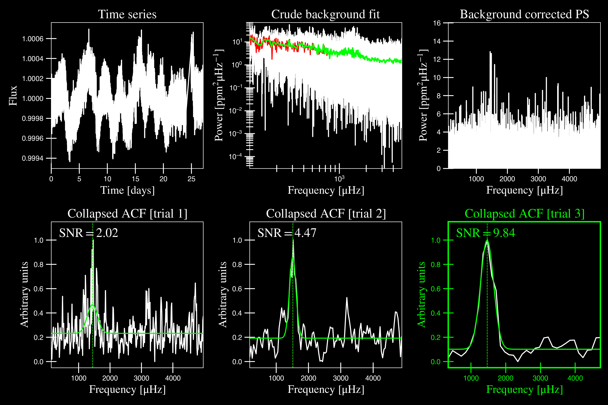
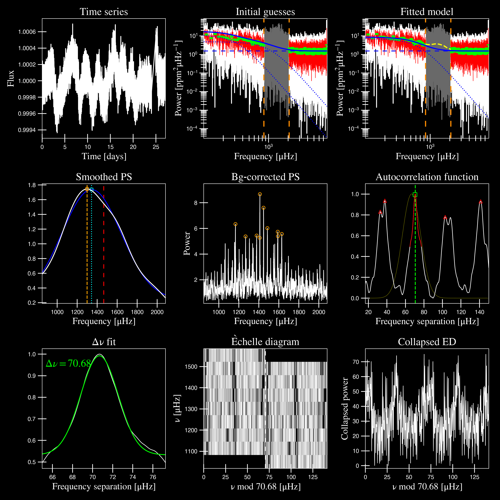
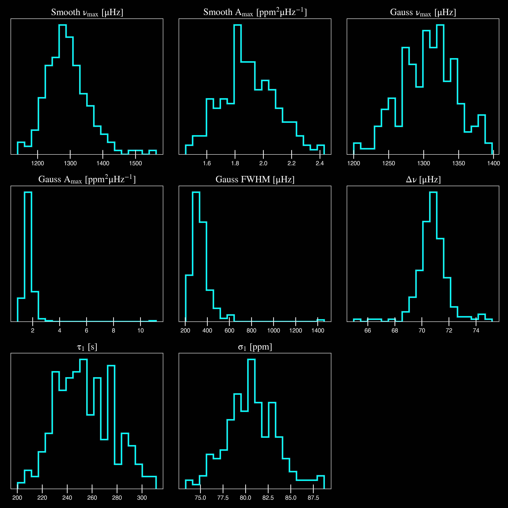

.. role:: underlined
   :class: underlined

*****************************
:underlined:`Getting started`
*****************************

A brief timeout
###############

The examples on this page assume that the user already has some basic-level knowledge or
experience with `Python`. If not, we recommend visiting the Python website and going through
some of `their tutorials <https://docs.python.org/3/tutorial/>`_ first before attempting 
ours.

We will work through two examples -- each demonstrating a different application of the software. 
Since `pySYD` was initially intended to be a hands-off :ref:`command-line tool <quickstart-script>`, 
the first will demonstrate exactly this since it was optimized for this. We will break
down each step of the software as much as possible with the hope that it will provide
a nice introduction to both the software *and* science. For the second one, we will reconstruct everything in a more condensed version and show
`pySYD` imported and used as a module.

If you have *any* questions, check out our :ref:`user guide <user-guide>` for more 
information. If this still does not address your question or problem, please do not hesitate
to contact `Ashley <achontos@hawaii.edu>`_ directly.

.. warning::

    It is **critical** that the input data are in the proper units in order for ``pySYD`` 
    to work properly and provide reliable results. If you are unsure about any of your units, 
    we recommend that you use *only* the light curve (in days) as input. In this case, the
    software will compute and normalize the power spectrum for you! For more information 
    about formatting and input data, please visit :ref:`this page <library-input>`.

-----

.. _quickstart-crash:

Crashteroseismology: a crash course in asteroseismology
#######################################################

For purposes of this first example, we'll assume that we don't know anything about the star or
its properties so that the software runs from start to finish on its own. In any normal circumstance,
however, we can provide additional inputs like the center of the frequency range with the 
oscillations, or :term:`numax` ( :math:`\rm \nu_{max}`), that can bypass steps and save time. 

.. role::  raw-html(raw)
    :format: html

.. _quickstart-script:

:underlined:`Initialize script`
*******************************

When running `pySYD` from command line, you will likely use something similar to the 
following command: 

.. _quickstart-script-command:

.. code-block::

    pysyd run --star 1435467 -dv --ux 5000 --mc 200

which we will now deconstruct.

``pysyd``
   if you used `pip` install, the binary (or executable) should be available. In fact, the setup
   file defines the entry point for ``pysyd``, which is accessed through the :mod:`pysyd.cli.main` 
   script -- where you can also find all available parsers and commands

``run`` 
   regardless of how you choose to use the software, the most common way you will likely implement
   ``pySYD`` is in run mode -- which, just as it sounds, will process stars in order. This is saved
   to the ``args`` parser ``NameSpace`` as the `mode`, which will run the pipeline by calling 
   :mod:`pysyd.pipeline.run`. There are currently five available (tested) modes (with two more in development), 
   all which are described in more detail :ref:`here <library-pipeline>`

``--star 1435467``
   here we are running a single star, KIC 1435467. You can also provide multiple targets,
   where the stars will append to a list and then be processed consecutively. On the other 
   hand, if no targets are provided, the program would default to reading in the star or `todo` 
   list (via `info/todo.txt`). Again, this is because the software is optimized for 
   running many stars.

``-dv``
   adapting Linux-like behavior, we reserved the single hash options for booleans which
   can all be grouped together (as shown above). Here the ``-d`` and ``-v`` are short for display and verbose, 
   respectively, and show the figures and verbose output. For a full list of options available, please 
   see our :ref:`command-line glossary <user-guide-cli-glossary>`. There are dozens of options to make your 
   experience as customized as you'd like!

``--ux 5000``
   this is an upper frequency limit for the first module that identifies the power eXcess 
   due to solar-like oscillations. In this case, there are high frequency artefacts that we would 
   like to ignore. *We actually made a special notebook tutorial specifically on how to address
   and fix this problem.* If you'd like to learn more about this or are having a similar issue, 
   please visit :ref:`this page <user-guide-nb-numaxhacks>`.

``--mc 200``
   last but certainly not least - the ``mc`` (for Monte Carlo-like) option sets the number 
   of iterations the pipeline will run for. In this case, the pipeline will run for 200 steps, 
   which allows us to bootstrap uncertainties on our derived properties. 

**Note:** For a *complete* list of options which are currently available via command-line interface (CLI), 
see our special CLI :ref:`glossary <user-guide-cli-glossary>`.

:underlined:`The steps`
***********************

.. _quickstart-script-steps:

The software operates in roughly the following steps:

 #. :ref:`Load in parameters and data <quickstart-script-steps-one>`
 #. :ref:`Get initial values <quickstart-script-steps-two>`
 #. :ref:`Fit global parameters <quickstart-script-steps-three>`
 #. :ref:`Estimate uncertainties <quickstart-script-steps-four>`

For each step, we will first show the relevant block of printed (or :term:`verbose<-v, --verbose>`) output, then
describe what the software is doing behind the scenes and if applicable, conclude with the section-specific 
results (i.e. files, figures, etc.).

.. _quickstart-script-steps-one:

1. Load in parameters and data
++++++++++++++++++++++++++++++

.. code-block::

    -----------------------------------------------------------
    Target: 1435467
    -----------------------------------------------------------
    # LIGHT CURVE: 37919 lines of data read
    # Time series cadence: 59 seconds
    # POWER SPECTRUM: 99518 lines of data read
    # PS oversampled by a factor of 5
    # PS resolution: 0.426868 muHz
    -----------------------------------------------------------

During this step, it will take the star name along with the command-line arguments and 
create an instance of the :mod:`pysyd.target.Target` object. Initialization of this class
will automatically search for and load in data for the given star, as shown in the output above.
Both the light curve and power spectrum were available for KIC 1435467 and as you can see in 
these cases, ``pySYD`` will use both arrays to compute additional information like the time 
series cadence, power spectrum resolution, etc.

*If there are issues during the first step,* ``pySYD`` *will flag this and immediately halt 
any further execution of the code.* If something seems questionable during this step but 
is not fatal for executing the pipeline, it will only return a warning. In fact, all 
:mod:`pysyd.target` class instances will have an ``ok`` attribute - literally meaning 
that the star is 'ok' to be processed. By default, the pipeline checks this attribute 
before moving on. 

Since none of this happened, we can move on to the next step.

.. _quickstart-script-steps-two:

2. Get initial values
+++++++++++++++++++++

.. code-block::

    -----------------------------------------------------------
    PS binned to 228 datapoints
    
    Numax estimates
    ---------------
    Numax estimate 1: 1440.07 +/- 81.33
    S/N: 2.02
    Numax estimate 2: 1513.00 +/- 50.26
    S/N: 4.47
    Numax estimate 3: 1466.28 +/- 94.06
    S/N: 9.84
    Selecting model 3
    -----------------------------------------------------------

The main thing we need to know before performing the global fit is an approximate starting point 
for the frequency corresponding to maximum power, or :term:`numax` (:math:`\rm \nu_{max}`).
Please read the next section for more information regarding this.

The software first makes a very rough approximation of the stellar background by binning the 
power spectrum in both log and linear spaces (think a very HEAVY smoothing filter), which the
power spectrum is then divided by so that we are left with very little residual slope in the :term:`PS`.
The 'Crude Background Fit' is shown below in the second panel by the lime green line. The
background-corrected power spectrum (:term:`BCPS`) is shown in the panel to the right.

Next ``pySYD`` uses a "collapsed" autocorrelation function (:term:`ACF`) technique with different 
bin sizes to identify localized power excess in the PS due to solar-like oscillations. By default, 
this is done three times (or trials) and hence, provides three different estimates - which is
typically sufficient for these purposes. The bottom row in the above figure shows these three trials, 
highlighting the one that was selected, or the one with the highest signal-to-noise (S/N).

Finally, it saves the best estimates in a csv file for later use, which can be used to bypass
this step the next time that the star is processed.

.. csv-table:: 1435467 parameter estimates
   :header: "stars", "numax", "dnu", "snr"
   :widths: 20, 20, 20, 20

   1435467, 1466.27585610943, 73.4338977674559, 9.84295865829856

.. _quickstart-script-steps-three:

3. Fit global parameters
++++++++++++++++++++++++

.. code-block::

    -----------------------------------------------------------
    GLOBAL FIT
    -----------------------------------------------------------
    PS binned to 333 data points
    
    Background model
    ----------------
    Comparing 6 different models:
    Model 0: 0 Harvey-like component(s) + white noise fixed
     BIC = 981.66 | AIC = 2.95
    Model 1: 0 Harvey-like component(s) + white noise term
     BIC = 1009.56 | AIC = 3.02
    Model 2: 1 Harvey-like component(s) + white noise fixed
     BIC = 80.27 | AIC = 0.22
    Model 3: 1 Harvey-like component(s) + white noise term
     BIC = 90.49 | AIC = 0.24
    Model 4: 2 Harvey-like component(s) + white noise fixed
     BIC = 81.46 | AIC = 0.20
    Model 5: 2 Harvey-like component(s) + white noise term
     BIC = 94.36 | AIC = 0.23
    Based on BIC statistic: model 2
    -----------------------------------------------------------
    Output parameters
    -----------------------------------------------------------
    numax_smooth: 1299.81 muHz
    A_smooth: 1.74 ppm^2/muHz
    numax_gauss: 1344.46 muHz
    A_gauss: 1.50 ppm^2/muHz
    FWHM: 294.83 muHz
    dnu: 70.68 muHz
    tau_1: 234.10 s
    sigma_1: 87.40 ppm
    -----------------------------------------------------------
     - displaying figures
     - press RETURN to exit
     - combining results into single csv file
    -----------------------------------------------------------

A bulk of the heavy lifting is done in this main fitting routine, which is actually done 
in two separate steps: 1) modeling and characterizing the stellar background and 2) determining 
the global asteroseismic parameters. We do this *separately* in two steps because they have 
fairly different properties and we wouldn't want either of the estimates to be influenced by 
the other in any way. 

Ultimately the stellar background has more of a "presence" in the power spectrum in that, 
dissimilar to solar-like oscillations that are observed over a small range of frequencies, the
stellar background contribution is observed over all frequencies. Therefore by attempting to 
identify where the oscillations are in the power spectrum, we can mask them out to better 
characterize the background.

We should take a sidestep to explain something important that is happening behind the scenes.
A major reason why the predecessor to `pySYD`, IDL-based `SYD`, was so successful was because
it assumed that the estimated numax and granulation timescales could be scaled with the Sun --
a fact that was not known at the time but greatly improved its ability to quickly and efficiently
process stars. This is clearly demonstrated in the 2nd and 3rd panels in the figure below, 
where the initial guesses are strikingly similar to the fitted model.

While this scaling relation ensured great starting points for the background fit, `SYD` still
required a lot fine-tuning by the user. Therefore we adapted the same approach but instead
implemented an automated background model seletion. After much trial and error, the :term:`BIC`
seems to perform better for our purposes - which is now the default metric used (but can easily
be changed, if desired).

Measuring the granulation time scales is obviously limited by the total observation baseline
of the time series but in general, we can resolve up to 3 Harvey-like components (or laws) 
at best (for now anyway). For more information about the Harvey model, please see the original 
paper [1]_ as well as its application in context .

Therefore we use all this information to guess how many we should observe and end up with

.. math::

    n_{\mathrm{models}} = 2 \cdot (n_{\mathrm{laws}}+1)

models for a given star. The fact of 2 is because we give the options to fix the white noise 
or for it to also be a free parameter. The +1 (times 2) is because we also want to consider 
the simplest model i.e. where we are not able to resolve any. From our perspective, the main 
purpose of implementing this was to try to identify null detections, since we do not expect 
to observe oscillations in every star. **However, this is a work in progress and we are still
trying various methods to identify and quantify non-detections. Therefore if you have any ideas, 
please reach out to us!** 

For this example we started with two Harvey-like components but the automated model selection
preferred a simpler one consisting of a single Harvey law. In addition, the white noise was
fixed and *not* a free parameter and hence, the final model had 3 less parameters than it started
with. For posterity, we included the output if only a single iteration had been run (which we 
recommend by default when analyzing a star for the first time). 

.. note::

   For more information about what each panel is showing in any of these figures, please visit 
   :ref:`this page <library-output-figures>`.

If this was run in its default setting, with ``--mc`` = `1`, for a single iteration, the output
parameters would look like that below. **We urge folks to run new stars for a single step first 
(ALWAYS) before running it several iterations to make sure everything looks ok.**

**One final important note:** we chose to show this example since it is a perfect testament for
why we do the fitting in two steps. You can see the estimate from the first module quoted a value
close to 1500 microhertz but it still got the final value correct. Background fits and the order
of operations *does* matter.

.. csv-table:: 1435467 global parameters
   :header: "parameter", "value", "uncertainty"
   :widths: 20, 20, 20

   numax_smooth, 1299.81293631, --
   A_smooth, 1.74435577479371, --
   numax_gauss, 1344.46209203309, --
   A_gauss, 1.49520571806361, --
   FWHM, 294.828524961042, --
   dnu, 70.6845197924864, --
   tau_1, 234.096929937095, --
   sigma_1, 87.4003388623678, --

.. note::

    While observations have shown that solar-like oscillations have an approximately 
    Gaussian-like envelope, we have no reason to believe that they should behave exactly 
    like that. This is why you will see two different estimates for :term:`numax` 
    (:math:`\rm \nu_{max}`) under the output parameters. **In fact for this methodology 
    first demonstrated in Huber+2009, traditionally the smoothed numax has been used in 
    the literature and we recommend that you do the same.**

.. _quickstart-script-steps-four:

4. Estimate uncertainties
+++++++++++++++++++++++++

.. code-block::

    -----------------------------------------------------------
    GLOBAL FIT
    -----------------------------------------------------------
    PS binned to 333 data points
    
    Background model
    ----------------
    Comparing 6 different models:
    Model 0: 0 Harvey-like component(s) + white noise fixed
     BIC = 981.66 | AIC = 2.95
    Model 1: 0 Harvey-like component(s) + white noise term
     BIC = 1009.56 | AIC = 3.02
    Model 2: 1 Harvey-like component(s) + white noise fixed
     BIC = 80.27 | AIC = 0.22
    Model 3: 1 Harvey-like component(s) + white noise term
     BIC = 90.49 | AIC = 0.24
    Model 4: 2 Harvey-like component(s) + white noise fixed
     BIC = 81.46 | AIC = 0.20
    Model 5: 2 Harvey-like component(s) + white noise term
     BIC = 94.36 | AIC = 0.23
    Based on BIC statistic: model 2
    -----------------------------------------------------------
    Sampling routine:
    100%|███████████████████████████████████████| 200/200 [00:21<00:00,  9.23it/s]
    -----------------------------------------------------------
    Output parameters
    -----------------------------------------------------------
    numax_smooth: 1299.81 +/- 50.31 muHz
    A_smooth: 1.74 +/- 0.21 ppm^2/muHz
    numax_gauss: 1344.46 +/- 35.97 muHz
    A_gauss: 1.50 +/- 0.24 ppm^2/muHz
    FWHM: 294.83 +/- 68.78 muHz
    dnu: 70.69 +/- 0.72 muHz
    tau_1: 234.10 +/- 17.82 s
    sigma_1: 87.40 +/- 2.54 ppm
    -----------------------------------------------------------
     - displaying figures
     - press RETURN to exit
     - combining results into single csv file
    -----------------------------------------------------------

Notice the difference in the printed parameters this time - they now have uncertainties!

We include the progress bar in the sampling step iff the verbose output is `True` *and* ``pySYD`` is not 
executed in parallel mode. This is hard-wired since the latter would produce a nightmare mess.

^^ posteriors for KIC 1435467

.. csv-table:: 1435467 global parameters
   :header: "parameter", "value", "uncertainty"
   :widths: 20, 20, 20

   numax_smooth, 1299.81293631, 56.642346824238
   A_smooth, 1.74435577479371, 0.191605473120388
   numax_gauss, 1344.46209203309, 41.160592041828
   A_gauss, 1.49520571806361, 0.236092716197938
   FWHM, 294.828524961042, 64.57265346103
   dnu, 70.6845197924864, 0.821246814829682
   tau_1, 234.096929937095, 23.6514289023765
   sigma_1, 87.4003388623678, 2.81297225855344

* matches expected output for model 4 selection - notice how there is no white noise term
in the output. this is because the model preferred for this to be fixed

.. note::

    The sampling results can be saved by using the boolean flag ``-m`` or ``--samples``,
    which will save the posteriors of the fitted parameters for later use. 
   

-----

.. _quickstart-module:

Running your favorite star
##########################

Initially all defaults were set and saved from the command line parser but we recently 
extended the software capabilities -- which means that it is more user-friendly and 
how you choose to use it is now completely up to you! 

Alright so let's import the package for this example.

    >>> from pysyd import utils 
    >>> name = '1435467'
    >>> args = utils.Parameters(stars=[name])
    >>> args
    <PySYD Parameters>

Analogous to the command-line arguments, we have a container class (:mod:`pysyd.utils.Parameters`)
that can easily be loaded in and modified to the user's needs. There are two keyword arguments that 
the Parameter object accepts -- `args` and `stars` -- both which are `None` by default. In fact, 
the `Parameters` class was also initialized in the first example but immediately knew it was executed 
as a script instead because `args` was *not* `None`.

As shown in the third line, we put the star list in list form **even though we are only processing 
a single star**. This is because both `pySYD` modes that proess stars iterate through the lists, 
so we feed it a list that is iterable so it doesn't get confused. 

Now that we have our parameters, let's create a pipeline :mod:`pysyd.target.Target` 
object to process.

    >>> from pysyd.target import Target
    >>> star = Target(name, args)
    >>> star
    <Star 1435467>

Typically this step will flag anything that doesn't seem right in the event that data is missing or
the path is not correct *but just in case*, there is also an `ok` attribute -- which literally means 
the star is o-k to go! `Target.ok` is simply a boolean flag but let's check it for good practice:

    >>> star.ok
    True

Finally, we will use the same settings we used in the first example -- so we need to update those first
before running.

    >>> star.params['upper_ex'] = 5000.
    >>> star.params['mc_iter'] = 200
    >>> star.process_star()
     - press RETURN to exit

Ok, now that we have our desired settings and target, we can go ahead and process the star!

.. plot::
    :align: center
    :context: close-figs
    :width: 60%

    from pysyd import utils
    from pysyd import plots
    from pysyd.target import Target
    import matplotlib.pyplot as plt

    name='1435467'
    args = utils.Parameters()
    star = Target(name, args)
    star.estimate_parameters()
    plots.set_plot_params()
    plots.plot_estimates()

    >>> from pysyd import plots

-----

.. [1] `Harvey (1985) <https://ui.adsabs.harvard.edu/abs/1985ESASP.235..199H>`_
