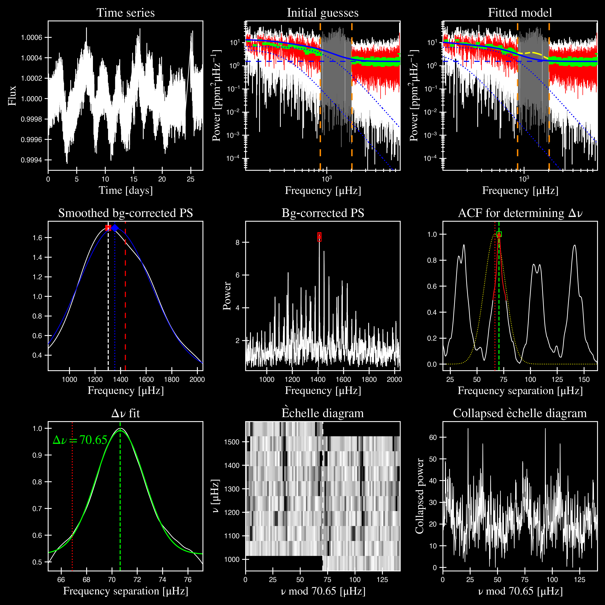
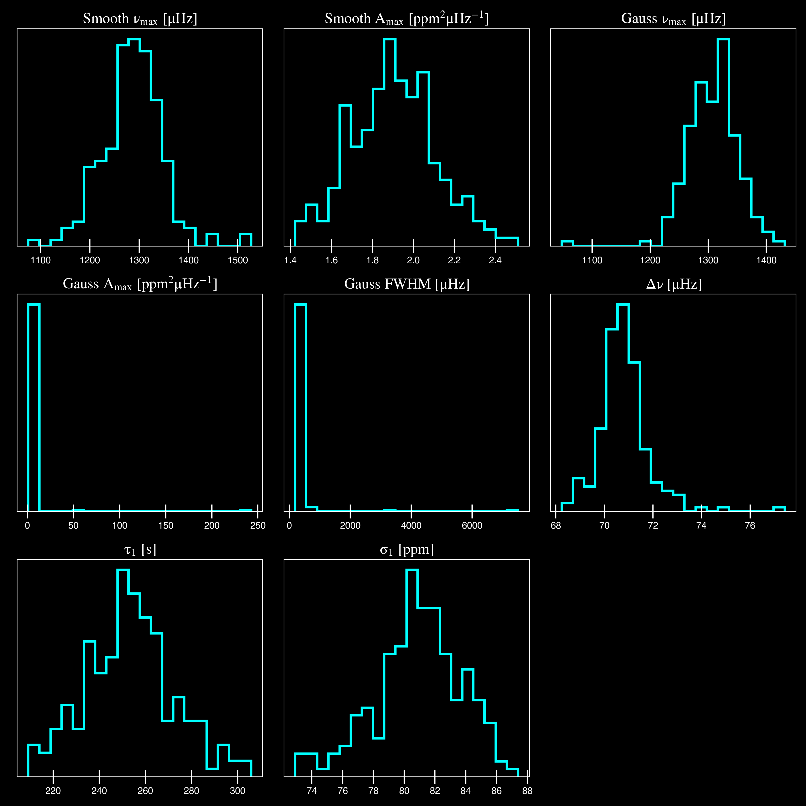

**********
Quickstart
**********

The examples on this page assumes that the user already has some basic-level knowledge or
experience with `Python`.

Installation & setup
####################

We recommend creating a local directory to keep all your pysyd-related data, results 
and information in a single, easy-to-find location. The software package comes with a 
convenient setup feature that downloads example data so let's start there.

Open up a terminal window and type the following commands in order:

.. code-block::

    python -m pip install pysyd
    mkdir ~/path/to/local/pysyd/directory
    cd ~/path/to/local/pysyd/directory
    pysyd setup --verbose

You may have noticed that, for this last point, we used the optional 
:term:`--verbose<-v, --verbose>` command, which *should* print the following output:

.. code-block::
    
    Downloading relevant data from source directory:
      % Total    % Received % Xferd  Average Speed   Time    Time     Time  Current
                                       Dload  Upload   Total   Spent    Left  Speed
     100    25  100    25    0     0     49      0 --:--:-- --:--:-- --:--:--    49
      % Total    % Received % Xferd  Average Speed   Time    Time     Time  Current
                                       Dload  Upload   Total   Spent    Left  Speed
     100   239  100   239    0     0    508      0 --:--:-- --:--:-- --:--:--   508
      % Total    % Received % Xferd  Average Speed   Time    Time     Time  Current
                                       Dload  Upload   Total   Spent    Left  Speed
     100 1518k  100 1518k    0     0  1601k      0 --:--:-- --:--:-- --:--:-- 1601k
      % Total    % Received % Xferd  Average Speed   Time    Time     Time  Current
                                       Dload  Upload   Total   Spent    Left  Speed
     100 3304k  100 3304k    0     0  2958k      0  0:00:01  0:00:01 --:--:-- 2958k
      % Total    % Received % Xferd  Average Speed   Time    Time     Time  Current
                                       Dload  Upload   Total   Spent    Left  Speed
     100 1679k  100 1679k    0     0  1630k      0  0:00:01  0:00:01 --:--:-- 1630k
      % Total    % Received % Xferd  Average Speed   Time    Time     Time  Current
                                       Dload  Upload   Total   Spent    Left  Speed
     100 3523k  100 3523k    0     0  3101k      0  0:00:01  0:00:01 --:--:-- 3099k
      % Total    % Received % Xferd  Average Speed   Time    Time     Time  Current
                                       Dload  Upload   Total   Spent    Left  Speed
     100 1086k  100 1086k    0     0   943k      0  0:00:01  0:00:01 --:--:--  943k
      % Total    % Received % Xferd  Average Speed   Time    Time     Time  Current
                                       Dload  Upload   Total   Spent    Left  Speed
     100 2578k  100 2578k    0     0  2391k      0  0:00:01  0:00:01 --:--:-- 2391k
    
      - created input file directory: /Users/ashleychontos/Desktop/pysyd/info
      - created data directory at /Users/ashleychontos/Desktop/pysyd/data
      - example data saved
      - results will be saved to /Users/ashleychontos/Desktop/pysyd/results
    
As shown above, the feature downloaded example data and other relevant items
from the `public GitHub repo <https://github.com/ashleychontos/pySYD>`_. 

You are now ready to become an asteroseismologist!

.. warning::

    Time and frequency *must* be in the specified units in order for the pipeline to properly process 
    the data and provide reliable results. **If you are unsure about this, we recommend**
    **ONLY providing the time series data in order to let** ``pySYD`` **calculate and
    normalize the power spectrum for you.** Again, if you choose to do this, the time series data
    *must* be in units of days in order for the frequency array to be calculated correctly. For
    more information on formatting and inputs, please see :ref:`here <library/input>`.

The 411
#######

The intended audience for ``pySYD`` is for non-expert users and therefore, the software was
initially developed as a *strictly* command-line, end-to-end tool. However, the software has
become more modular in recent updates and thus enabling compatibility with other interactive 
sessions such as `Python` notebooks.

We will demonstrate each of these cases in examples on this page but please see our 
:ref:`user guide <usage/index>` for more information. 

In general, the software operates in the following steps:
 #. :ref:`Loads in parameters and data <stepone>`
 #. :ref:`Estimates starting points <steptwo>`
 #. :ref:`Fits global parameters <stepthree>`
 #. :ref:`Estimates uncertainties <stepfour>`

Each of the four main steps are discussed in detail below.

Running your first asteroseismic analyses
#########################################

The software is optimized for running many stars and hence, many of the defaults 
parameters need to be changed in order to understand how the software works. We will
use the command-line example to break everything down, and then put it all together
in a condensed version for the second.

As a script
***********

Open up a terminal window and enter the following command:

.. code-block::

    pysyd run --star 1435467 -dv --ux 5000 --mc 200

Ok, let's dissect the statement.

 * If you used `pip` for installation, the binary (or executable) for ``pySYD`` should be available. 
   The entry point for ``pySYD`` is accessed through :mod:`pysyd.cli.main`, which is the script where 
   all the command-line options are made available.
 * Regardless of how you use the software, the most common way you will likely use the software is in the
   run (i.e. :mod:`pysyd.pipeline.run`) mode -- which processes stars in the order they were provided.
   Here, we are running a single star, KIC 1435467. You can also provide multiple targets,
   the stars which will be appended to a list and then processed consecutively. On the other 
   hand if no targets are provided, the program would default to reading in the star or 'todo' 
   list (via 'info/todo.txt'). Again, this is because the software is optimized for 
   running an ensemble of stars.
 * Adapting Linux-like features, we reserved the single hash options for booleans, which as shown above,
   can be all grouped together. The ``-d`` and ``-v`` are short for display and verbose, 
   respectively, and show the figures and verbose output. For a full list of options available
   in command line, please see our glossary.:ref:`complete list <usage/cli/glossary>`. 
   There are dozens of options to make your experience as customizable as possible!
 * The ``--ux`` is an upper frequency limit for the first module that identifies the power eXcess 
   due to solar-like oscillations. In this case, there are high frequency artefacts that we would 
   like to ignore. *We actually made a special notebook tutorial specifically on how to address
   and fix this problem.* If you'd like to learn more about this or are having a similar issue, 
   please visit :ref:`this page <usage/nb/estimatenumax.ipynb>`.
 * Finally, the last option, ``--mc``, sets the number of iterations the pipeline will run for. Here,
   the pipeline will run for 200 steps, which allows us to bootstrap uncertainties on our 
   derived properties. 

Now the printed output for the above command is actually quite long, so we will break it down 
into four different sections and explain each in more detail. In fact, each of the four sections
correspond to the four main ``pySYD`` steps discussed in the summary above.

.. _stepone:

1. Load in parameters and data
^^^^^^^^^^^^^^^^^^^^^^^^^^^^^^

If there are issues during the first step, ``pySYD`` will flag this and immediately halt 
any further execution of the code. 

.. code-block::

    -----------------------------------------------------------
    Target: 1435467
    -----------------------------------------------------------
    # LIGHT CURVE: 37919 lines of data read
    # Time series cadence: 59 seconds
    # POWER SPECTRUM: 99518 lines of data read
    # PS oversampled by a factor of 5
    # PS resolution: 0.426868 muHz
    -----------------------------------------------------------

During this step, it will take the star name along with the command-line arguments and 
created an instance of the :mod:`pysyd.target.Target` object. Initialization of this class
will automatically search for and load in data for a given star, as shown in the output above.

It appears as though this star, KIC 1435467, was observed in *Kepler* short-cadence (e.g., 
1-minute cadence) data - which was used to compute the (oversampled) power spectrum. 
There are many exceptions in place during this step that will flag anything that does not 
seem right. If something seems questionable during this step but is not fatal, it will only 
return some warnings. Since none of this happened, we can assume that there were no issues
accessing and storing the data.

All :mod:`pysyd.target` class instances will have an ``ok`` attribute - literally meaning 
that the star is 'ok' to be processed. By default, the pipeline checks this attribute before 
moving on. Since everything checks out, we can move on!

.. _steptwo:

2. Estimates starting points
^^^^^^^^^^^^^^^^^^^^^^^^^^^^

For purposes of the example, we will assume that we do not know anything about its properties. 
Typically we can provide optional inputs in many different ways but we won't here so it can 
estimate the properties on its own.

.. code-block::

    -----------------------------------------------------------
    PS binned to 173 datapoints
    
    Numax estimates
    ---------------
    Numax estimate 1: 1416.12 +/- 86.91
    S/N: 2.18
    Numax estimate 2: 1464.42 +/- 76.62
    S/N: 4.33
    Numax estimate 3: 1438.28 +/- 97.24
    S/N: 12.38
    Selecting model 3
    -----------------------------------------------------------

As discussed above, the main thing we need to know before doing the global fit is a rough 
starting point for the frequency corresponding to maximum power, or :term:`numax` (:math:`\rm \nu_{max}`).

It does this by making a very rough approximation of the stellar background by binning the 
power spectrum in both log and linear spaces (think a very HEAVY smoothing filter) and divides
this out so that we are left with very little residual slope in the power spectrum.

Next it uses a "collapsed" autocorrelation function (ACF) technique with different bin sizes
to identify localized power excess in the power spectrum due to solar-like oscillations. By
default, this is done three times (or trials) and hence, get three different estimates.

.. image:: _static/quickstart/1435467_estimates.png
  :width: 680
  :alt: Parameter estimates for KIC 1435467

.. csv-table:: 1435467 parameter estimates
   :header: "stars", "numax", "dnu", "snr"
   :widths: 20, 20, 20, 20

   1435467, 1438.27561061044, 72.3140769912867, 12.3801364686659

.. _stepthree:

3. Fits global parameters
^^^^^^^^^^^^^^^^^^^^^^^^^

A bulk of the heavy lifting is done in this main fitting routine, which is actually done 
in two separate steps: 1) modeling and characterizing the stellar background and 2) determining 
the global asteroseismic parameters. We do this *separately* in two steps because they have 
fairly different properties and we wouldn't want either of the estimates to be influenced by 
the other in any way. 

Ultimately the stellar background has more of a presence in the power spectrum in that it is 
observed over a wider range of frequencies compared to the solar-like oscillations. Therefore 
by attempting to identify where the oscillations are in the power spectrum, we can mask 
them out to better characterize the background.

.. code-block::

    -----------------------------------------------------------
    GLOBAL FIT
    -----------------------------------------------------------
    PS binned to 335 data points
    
    Background model
    ----------------
    Comparing 6 different models:
    Model 0: 0 Harvey-like component(s) + white noise fixed
     BIC = 981.74 | AIC = 2.93
    Model 1: 0 Harvey-like component(s) + white noise term
     BIC = 1009.29 | AIC = 3.00
    Model 2: 1 Harvey-like component(s) + white noise fixed
     BIC = 80.37 | AIC = 0.22
    Model 3: 1 Harvey-like component(s) + white noise term
     BIC = 90.83 | AIC = 0.24
    Model 4: 2 Harvey-like component(s) + white noise fixed
     BIC = 81.50 | AIC = 0.20
    Model 5: 2 Harvey-like component(s) + white noise term
     BIC = 94.42 | AIC = 0.22
    Based on AIC statistic: model 4
    -----------------------------------------------------------

Unlike previous versions of this software and previous versions of this software (i.e. `SYD`), 
we have now implemented an automated background model selection. For reference, 

After much trial and error, the :term:`AIC` seems to perform better for our purposes - which
is why this is now the default metric used.

.. _stepfour:

4. Estimates uncertainties
^^^^^^^^^^^^^^^^^^^^^^^^^^

If this was run in its default settings (with --mc 1) for a single iteration, the output
would look comparable but with no progress bar and no parameter uncertainties.

.. code-block::

    -----------------------------------------------------------
    Sampling routine:
    100%|███████████████████████████████████████| 200/200 [00:21<00:00,  9.23it/s]
    -----------------------------------------------------------
    Output parameters
    -----------------------------------------------------------
    numax_smooth: 1303.83 +/- 65.19 muHz
    A_smooth: 1.70 +/- 0.21 ppm^2/muHz
    numax_gauss: 1354.19 +/- 43.04 muHz
    A_gauss: 1.46 +/- 0.29 ppm^2/muHz
    FWHM: 284.63 +/- 64.57 muHz
    dnu: 70.65 +/- 0.81 muHz
    tau_1: 1069.92 +/- 2121.15 s
    sigma_1: 31.10 +/- 42.95 ppm
    tau_2: 218.30 +/- 20.25 s
    sigma_2: 85.48 +/- 3.68 ppm
    -----------------------------------------------------------
     - displaying figures
     - press RETURN to exit
     - combining results into single csv file
    -----------------------------------------------------------

^^ posteriors for KIC 1435467

We include a progress bar in the sampling step iff the verbose output is `True` *and*
``pySYD`` is not executed in parallel mode. This is hard-wired since the latter would
produce a nightmare mess.

.. csv-table:: 1435467 global parameters
   :header: "parameter", "value", "uncertainty"
   :widths: 20, 20, 20

   numax_smooth, 1303.82549513, 65.1861645150548
   A_smooth, 1.6981881189944, 0.208329237417828
   numax_gauss, 1354.18609943197, 43.0399300425255
   A_gauss, 1.45587282712706, 0.286045233580998
   FWHM, 284.631831313442, 64.5689284576161
   dnu, 70.653293964844, 0.81171745376397
   tau_1, 1069.91765124738, 2121.15050259705
   sigma_1, 31.1026782311927, 42.9475567908216
   tau_2, 218.303624326155, 20.2541392707925
   sigma_2, 85.4836783903674, 3.68355287162928

* matches expected output for model 4 selection - notice how there is no white noise term
in the output. this is because the model preferred for this to be fixed
   

    
.. note::

    While observations have shown that solar-like oscillations have an approximately 
    Gaussian-like envelope, we have no reason to believe that they should behave exactly 
    like that. This is why you will see two different estimates for :term:`numax` 
    (:math:`\rm \nu_{max}`) under the output parameters. ***In fact for this methodology 
    first demonstrated in Huber+2009, traditionally the smoothed numax has been used in 
    the literature and we recommend that you do the same.***

As a module
***********

A majority of the heavy lifting is done in the ``pySYD.target.Target`` class. Each star
that is processed is initialized as a new target object, which in this case, we'll call star.

    >>> from pysyd import utils
    >>> from pysyd.target import Target

hey

    >>> name = '1435467'
    >>> args = utils.Parameters(stars=[name])
    >>> star = Target(name, args)
    >>> if star.ok:
    ...    star.estimate_parameters()
    ...    plots.set_plot_params()
    ...    plots.plot_estimates()

.. plot::
    :align: center
    :context: close-figs
    :width: 60%

    from pysyd import utils
    from pysyd import plots
    from pysyd.target import Target
    import matplotlib.pyplot as plt

    name='1435467'
    args = utils.Parameters()
    star = Target(name, args)
    star.estimate_parameters()
    plots.set_plot_params()
    plots.plot_estimates()

    >>> from pysyd import plots

To learn more about what these results mean, please visit BLANK.