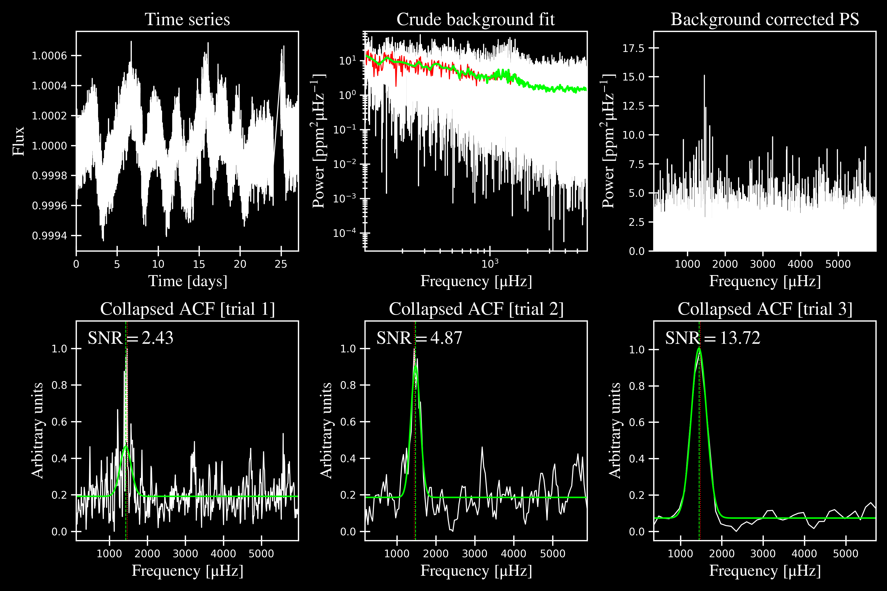
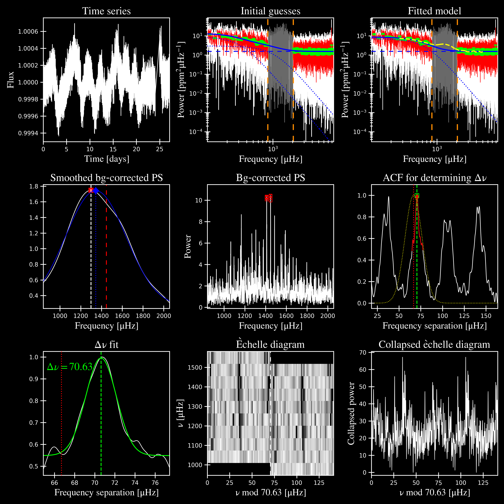

.. _quickstart:

##################
Quickstart
##################

Jump down to :ref:`summary` to get asteroseismic parameters for a star in less than one minute!

.. _installation:

Installation
***************

Install ``pysyd`` using pip:

.. code-block::

    $ pip install pysyd

The ``pysyd`` binary should have been automatically placed in your system's path by the
``pip`` command. If your system can not find the ``pysyd`` executable, ``cd`` into the 
top-level ``pysyd`` directory and try running the following command:

.. code-block::

    $ python setup.py install

You may test your installation by using ``pysyd --help`` to see the available commands or modes:

.. code-block::
		
    $ pysyd --help
    usage: pySYD [-h] [-version] {load,parallel,run,setup,test} ...

    pySYD: Automated Extraction of Global Asteroseismic Parameters

    optional arguments:
      -h, --help            show this help message and exit
      -version, --version   Print version number and exit.

    pySYD modes:
      {load,parallel,run,setup,test}
        load                Load in data for a given target
        parallel            Run pySYD in parallel
        run                 Run the main pySYD pipeline
        setup               Easy setup of relevant directories and files
        test                Test different utilities (currently under development)

Setting up
************

The easiest way to start using the ``pySYD`` package is by running our ``setup`` feature
from a convenient directory:

.. code-block::

    $ pysyd setup

This command will create `data`, `info`, and `results` directories in the current working 
directory, if they don't already exist. Setup will also download two information files: 
**info/todo.txt** and **info/star_info.csv**. See :ref:`overview` for more information on 
what purposes these files serve. Additionally, three example stars 
from the `source code <https://github.com/ashleychontos/pySYD>`_ are included (see :ref:`examples`).

The optional verbose command can be called with the setup feature:

.. code-block::

    $ pysyd setup --verbose

This will print the absolute paths of all directories that are created during setup.

Example fit
*************

The ``setup`` feature downloads data for three example stars (to data/) provided: 1435467 (the least evolved), 
2309595 (~SG), and 11618103 (RGB). To run a single star, execute the main script with the following command:

.. code-block::

    $ pysyd run --star 1435467 -dv
    
    
    ------------------------------------------------------
    Target: 1435467
    ------------------------------------------------------
    # LIGHT CURVE: 37919 lines of data read
    # Time series cadence: 59 seconds
    # POWER SPECTRUM: 99518 lines of data read
    # PS is oversampled by a factor of 5
    # PS resolution: 0.426868 muHz
    ------------------------------------------------------
    Estimating numax:
    PS binned to 189 datapoints
    Numax estimate 1: 1430.02 +/- 72.61
    S/N: 2.43
    Numax estimate 2: 1479.46 +/- 60.64
    S/N: 4.87
    Numax estimate 3: 1447.42 +/- 93.31
    S/N: 13.72
    Selecting model 3
    ------------------------------------------------------
    Determining background model:
    PS binned to 419 data points
    Comparing 6 different models:
    Model 0: 0 Harvey-like component(s) + white noise fixed
    Model 1: 0 Harvey-like component(s) + white noise term
    Model 2: 1 Harvey-like component(s) + white noise fixed
    Model 3: 1 Harvey-like component(s) + white noise term
    Model 4: 2 Harvey-like component(s) + white noise fixed
    Model 5: 2 Harvey-like component(s) + white noise term
    Based on BIC statistic: model 2
     **background-corrected PS saved**
    ------------------------------------------------------
    Output parameters:
    tau_1: 233.71 s
    sigma_1: 87.45 ppm
    numax_smooth: 1299.56 muHz
    A_smooth: 1.75 ppm^2/muHz
    numax_gauss: 1345.03 muHz
    A_gauss: 1.49 ppm^2/muHz
    FWHM: 291.32 muHz
    dnu: 70.63 muHz
    ------------------------------------------------------
     - displaying figures
     - press RETURN to exit
     - combining results into single csv file
    ------------------------------------------------------
    
    

Here ``-dv`` means options ``-d`` and ``-v``, which stand for display (figures) and verbose output, 
respectively. Since ``pySYD`` is optimized for running multiple stars, both of these are ``False`` 
by default. We recommend using them for the example, since they are 
helpful to see how the pipeline processes targets. 

The above command should have yielded the following output figures:

from the first optional module that estimates numax (using 3 different trials).
All parameter derivations are done in the global fit, the results which are 
encapsulated in this figure:

To estimate uncertainties in the derived parameters, set ``--mc`` to a number sufficient for bootstrap sampling. In the previous 
example, ``--mc`` was not specified and is 1 by default (for 1 iteration). Below shows the same example with the
sampling enabled, including the verbose output you should see if your software was installed successfully.

.. code-block::

    $ pysyd run -star 1435467 -dv --mc 200
        
    
    ------------------------------------------------------
    Target: 1435467
    ------------------------------------------------------
    # LIGHT CURVE: 37919 lines of data read
    # Time series cadence: 59 seconds
    # POWER SPECTRUM: 99518 lines of data read
    # PS is oversampled by a factor of 5
    # PS resolution: 0.426868 muHz
    ------------------------------------------------------
    Estimating numax:
    PS binned to 189 datapoints
    Numax estimate 1: 1430.02 +/- 72.61
    S/N: 2.43
    Numax estimate 2: 1479.46 +/- 60.64
    S/N: 4.87
    Numax estimate 3: 1447.42 +/- 93.31
    S/N: 13.72
    Selecting model 3
    ------------------------------------------------------
    Determining background model:
    PS binned to 419 data points
    Comparing 6 different models:
    Model 0: 0 Harvey-like component(s) + white noise fixed
    Model 1: 0 Harvey-like component(s) + white noise term
    Model 2: 1 Harvey-like component(s) + white noise fixed
    Model 3: 1 Harvey-like component(s) + white noise term
    Model 4: 2 Harvey-like component(s) + white noise fixed
    Model 5: 2 Harvey-like component(s) + white noise term
    Based on BIC statistic: model 2
     **background-corrected PS saved**
    ------------------------------------------------------
    Running sampling routine:
    100%|█████████████████████████████████████████████████████████████████| 200/200 [00:17<00:00, 11.13it/s]
    
    Output parameters:
    tau_1: 233.71 +/- 20.50 s
    sigma_1: 87.45 +/- 3.18 ppm
    numax_smooth: 1299.56 +/- 56.64 muHz
    A_smooth: 1.75 +/- 0.24 ppm^2/muHz
    numax_gauss: 1345.03 +/- 40.66 muHz
    A_gauss: 1.49 +/- 0.28 ppm^2/muHz
    FWHM: 291.32 +/- 63.62 muHz
    dnu: 70.63 +/- 0.74 muHz
    ------------------------------------------------------
     - displaying figures
     - press RETURN to exit
     - combining results into single csv file
    ------------------------------------------------------
    
    
An additional output figure is created with the sampling routine,
displaying the posteriors for the fitted parameters:

.. image:: figures/quickstart/1435467_samples.png
  :width: 680
  :alt: Posteriors for KIC 1435467

Please visit :ref:`this page<examples>` for additional examples, including how to interpret the results
as well as descriptions about what the plots are showing.

.. _summary:

Summary
************

To determine asteroseismic parameters for a single star in roughly sixty seconds, execute 
the following commands:

.. code-block::

    $ mkdir ~/path_to_put_pysyd_stuff
    $ cd ~/path_to_put_pysyd_stuff
    $ pip install pysyd
    $ pysyd setup
    $ pysyd run --star 1435467 -dv --mc 200
        
... and if you weren't one already, you are now an asteroseismologist!
    
