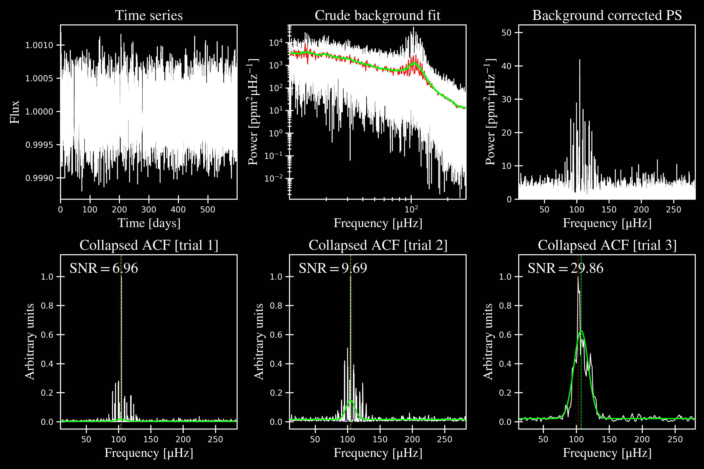
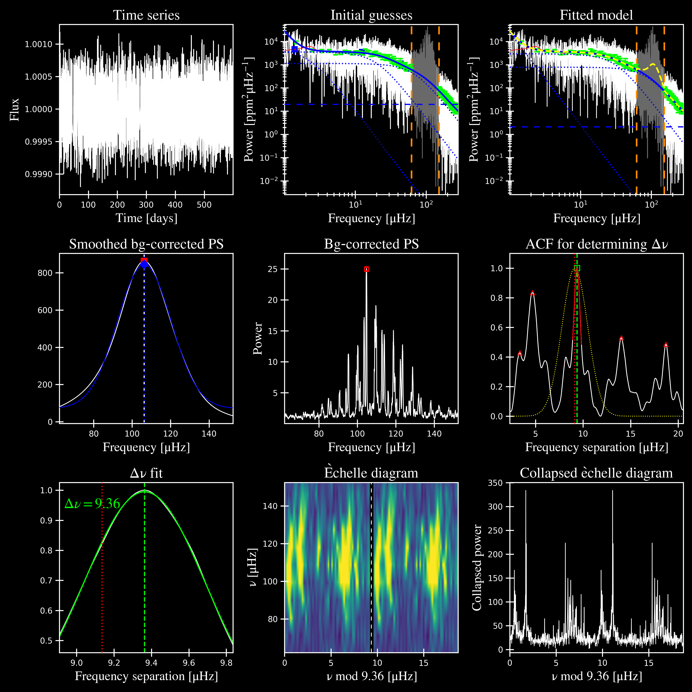
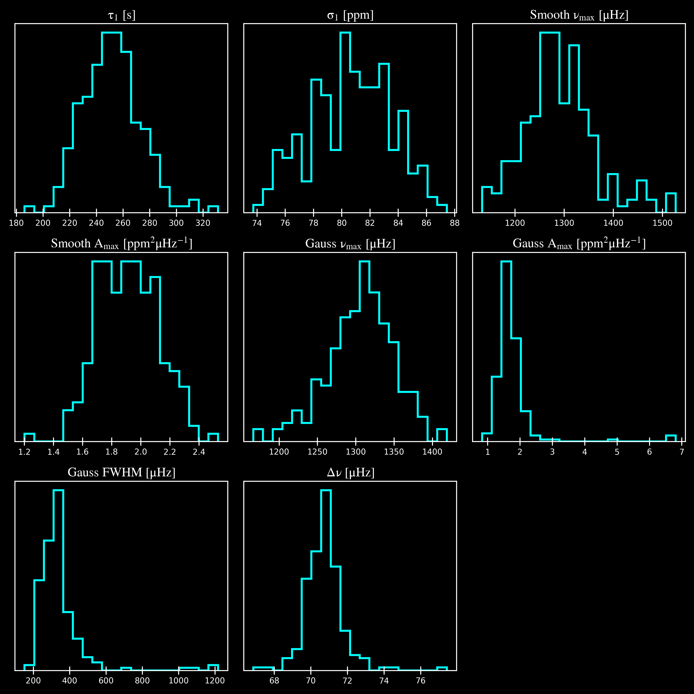
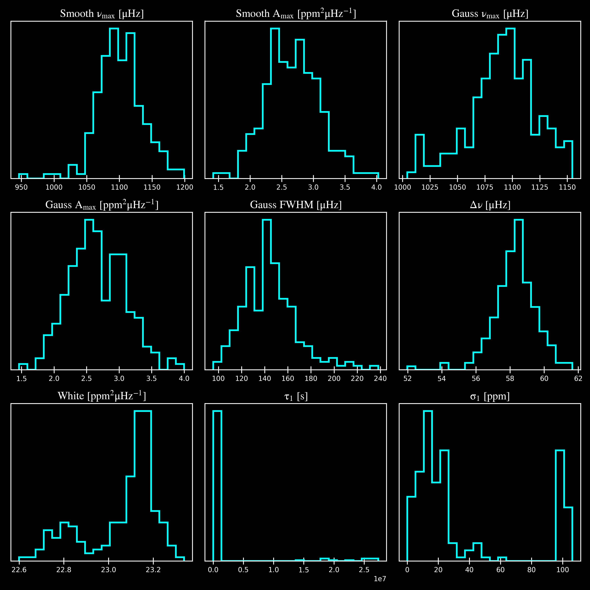

.. role:: bash(code)
   :language: bash

.. _user-guide-cli-examples:

*************
More examples
*************

This page has command-line examples for the following cases:

 -  single star applications of varying signal-to-noise (SNR) detections:

     -  :ref:`High SNR <user-guide-cli-examples-single-high>`
     -  :ref:`Medium SNR <user-guide-cli-examples-single-medium>`
     -  :ref:`Low SNR <user-guide-cli-examples-single-low>`
     -  :ref:`No SNR <user-guide-cli-examples-single-no>`

 -  running :ref:`many stars <user-guide-cli-examples-multiple>`
 -  :ref:`advanced examples <user-guide-cli-examples-advanced>` for special commands 

including what to look for in each case.

-----

.. _user-guide-cli-examples-single:

Single star applications
########################

For applications to single stars, we will start with a very easy, high signal-to-noise (SNR)
example, followed by medium, low, and no SNR examples. These examples will not be as detailed 
as the :ref:`quickstart example <quickstart-script>` -- our goal here is to provide pointers 
on what to look for for each case. 

-----

.. _user-guide-cli-examples-single-high:

High SNR: KIC 11618103
**********************

KIC 11618103 is our most evolved example, an RGB star with numax of ~100 muHz.

.. image:: ../../_static/examples/11618103_samples.png
  :width: 680
  :alt: KIC 11618103 parameter posteriors

**For a full breakdown of what each panel is showing, please see :ref:`this page <library/output>` for more details.**
  
  
.. note::

    The sampling results can be saved by using the boolean flag ``-m`` or ``--samples``,
    which will save the posteriors of the fitted parameters for later use. 

-----

.. _user-guide-cli-examples-single-medium:

Medium SNR: KIC 1435467
***********************

We used this example for new users just getting started and therefore we will only show
the output and figures. Feel free to visit that page :ref:`getting started <>`, which 
breaks down every step and output for this example.

KIC 1435467 is our least evolved example, with :math:`\rm \nu_{max} \sim 1300 \mu Hz`.

.. image:: ../../_static/examples/1435467_estimates.png
  :width: 680
  :alt: KIC 1435467 estimates

.. image:: ../../_static/examples/1435467_global.png
  :width: 680
  :alt: KIC 1435467 global fit

-----

.. _user-guide-cli-examples-single-low:

Low SNR: KIC 8801316
********************

As if asteroseismology wasn't hard enough, let's make it even more difficult for you!

KIC 8801316 is a subgiant with a numax ~1100 muHz, shown in the figures below. 

.. image:: ../../_static/examples/8801316_estimates.png
  :width: 680
  :alt: KIC 8801316 estimates

.. image:: ../../_static/examples/8801316_global.png
  :width: 680
  :alt: KIC 8801316 global fit

This would be classified as a detection despite the low SNR due to the following reasons:

- there is a clear power excess as seen in panel 3
- the power excess has a Gaussian shape as seen in panel 5 corresponding to the solar-like oscillations
- the autocorrelation function (ACF) in panel 6 show periodic peaks
- the echelle diagram in panel 8 shows the ridges, albeit faintly

-----

.. _user-guide-cli-examples-single-no:

No SNR: KIC 6278992
*******************

KIC 6278992 is a main-sequence star with no solar-like oscillations.

.. image:: ../../_static/examples/6278992_estimates.png
  :width: 680
  :alt: KIC 6278992 estimates

.. image:: ../../_static/examples/6278992_global.png
  :width: 680
  :alt: KIC 6278992 global fit

.. image:: ../../_static/examples/6278992_samples.png
  :width: 680
  :alt: KIC 6278992 parameter posteriors

-----

.. _user-guide-cli-examples-multiple:

Many stars
##########

Regular mode
************

Since this is optimized for running many stars via command line, the star names will be read in 
and processed from `'info/todo.txt'` if nothing else is provided:

.. code-block::

    $ pysyd run

Parallel mode
*************

There is a parallel processing option included in the software, which is helpful for
running many stars. This can be accessed through the following command:

.. code-block::

    $ pysyd parallel 

For parallel processing, `pySYD` will divide and group the list of stars based on the 
available number of threads. By default, this value is `0` but can be specified via 
the command line. If it is *not* specified and you are running in parallel mode, 
``pySYD`` will use ``multiprocessing`` package to determine the number of CPUs 
available on the current operating system and then set the number of threads to this 
value (minus `1`).

If you'd like to take up less memory, you can easily specify the number of threads with
the :term:`--nthreads<--nt, --nthread, --nthreads>` command:

.. code-block::

    $ pysyd parallel --nthreads 10 --list path_to_star_list.txt
   

-----

.. _user-guide-cli-examples-advanced:

******************
Advanced CLI usage
******************

Below are examples of different commands, including their before and after plots to demonstrate
the desired effects.

-----

:term:`--ew<--ew, --exwidth>` & :term:`--exwidth<--ew, --exwidth>`
##################################################################

Fractional amount to scale the width of the oscillations envelope by -- which is normally calculated
w.r.t. solar values.

+-------------------------------------------------------+-------------------------------------------------------+
| Before                                                | After                                                 |
+=======================================================+=======================================================+
| :bash:`pysyd run --star 9542776 --numax 900`          | :bash:`pysyd run --star 9542776 --numax 900 --ew 1.5` |
+-------------------------------------------------------+-------------------------------------------------------+
| .. figure:: ../../_static/examples/9542776_before.png | .. figure:: ../../_static/examples/9542776_after.png  |
|    :width: 680                                        |    :width: 680                                        |
+-------------------------------------------------------+-------------------------------------------------------+

-----

:term:`-k<-k, --kc, --kepcorr>`, :term:`--kc<-k, --kc, --kepcorr>` & :term:`--kepcorr<-k, --kc, --kepcorr>`
###########################################################################################################

Remove the well-known *Kepler* short-cadence artefact that occurs at/near the long-cadence :term:`nyquist frequency` 
(:math:`\sim 270 \mu \mathrm{Hz}`) by simulating white noise

+-------------------------------------------------------+------------------------------------------------------+
| Before                                                | After                                                |
+=======================================================+======================================================+
| :bash:`pysyd run --star 8045442 --numax 550`          | :bash:`pysyd run --star 8045442 --numax 550 --kc`    |
+-------------------------------------------------------+------------------------------------------------------+
| .. figure:: ../../_static/examples/8045442_before.png | .. figure:: ../../_static/examples/8045442_after.png |
|    :width: 680                                        |    :width: 680                                       |
+-------------------------------------------------------+------------------------------------------------------+

-----

:term:`--lp<--lp, --lowerp>` & :term:`--lowerp<--lp, --lowerp>`
###############################################################

Manually set the lower frequency bound (or limit) of the power excess, which is helpful
in the following scenarios:

 #. the width of the power excess is wildly different from that estimated by the solar scaling relation
 #. artefact or strange (typically not astrophysical) feature is close to the power excess and cannot be removed otherwise
 #. power excess is near the :term:`nyquist frequency`

+---------------------------------------------------------+--------------------------------------------------------+
| Before                                                  | After                                                  |
+=========================================================+========================================================+
| :bash:`pysyd run --star 10731424 --numax 750`           | :bash:`pysyd run --star 10731424 --numax 750 --lp 490` |
+---------------------------------------------------------+--------------------------------------------------------+
| .. figure:: ../../_static/examples/10731424_before.png  | .. figure:: ../../_static/examples/10731424_after.png  |
|    :width: 680                                          |    :width: 680                                         |
+---------------------------------------------------------+--------------------------------------------------------+

-----

:term:`--npeaks<--peaks, --npeaks>` & :term:`--peaks<--peaks, --npeaks>`
########################################################################

Change the number of peaks chosen in the autocorrelation function (:term:`ACF`) - this is especially
helpful for low S/N cases, where the spectrum is noisy and the ACF has many peaks close the expected
spacing (**FIX THIS**)

+-------------------------------------------------------+------------------------------------------------------+
| Before                                                | After                                                |
+=======================================================+======================================================+
| :bash:`pysyd run --star 9455860`                      | :bash:`pysyd run --star 9455860 --npeaks 10`         |
+-------------------------------------------------------+------------------------------------------------------+
| .. figure:: ../../_static/examples/9455860_before.png | .. figure:: ../../_static/examples/9455860_after.png |
|    :width: 680                                        |    :width: 680                                       |
+-------------------------------------------------------+------------------------------------------------------+

-----

:term:`--numax<--numax>`
########################

If the value of :math:`\rm \nu_{max}` is known, this can be provided to bypass the first module and save some time. 
There are also other ways to go about doing this, please see our notebook tutorial that goes through these different
ways.

+--------------------------------------------------------+-------------------------------------------------------+
| Before                                                 | After                                                 |
+========================================================+=======================================================+
| :bash:`pysyd run --star 5791521`                       | :bash:`pysyd run --star 5791521 --numax 670`          |
+--------------------------------------------------------+-------------------------------------------------------+
| .. figure:: ../../_static/examples/5791521_before.png  | .. figure:: ../../_static/examples/5791521_after.png  |
|    :width: 680                                         |    :width: 680                                        |
+--------------------------------------------------------+-------------------------------------------------------+

-----

:term:`--ux<--ux, --upperx>` & :term:`--upperx<--ux, --upperx>`
###############################################################

Set the upper frequency limit in the power spectrum when estimating :math:`\rm \nu_{max}` before the main fitting
routine. This is helpful if there are high frequency artefacts that the software latches on to.

+--------------------------------------------------------+-------------------------------------------------------+
| Before                                                 | After                                                 |
+========================================================+=======================================================+
| :bash:`pysyd run --star 11769801`                      | :bash:`pysyd run --star 11769801 --ux 3500`           |
+--------------------------------------------------------+-------------------------------------------------------+
| .. figure:: ../../_static/examples/11769801_before.png | .. figure:: ../../_static/examples/11769801_after.png |
|    :width: 680                                         |    :width: 680                                        |
+--------------------------------------------------------+-------------------------------------------------------+

-----

:term:`-i<-i, --ie, --interpech>`, :term:`--ie<-i, --ie, --interpech>` & :term:`--interpech<-i, --ie, --interpech>`
###################################################################################################################

Smooth the echelle diagram output by turning on the (bilinear) interpolation, which is helpful for identifying
ridges in low S/N cases

+--------------------------------------------------------+--------------------------------------------------------+
| Before                                                 | After                                                  |
+========================================================+========================================================+
| :bash:`pysyd run 3112889 --numax 871.52`               | :bash:`pysyd run --star 3112889 --numax 871.52 --ie`   |
+--------------------------------------------------------+--------------------------------------------------------+
| .. figure:: ../../_static/examples/3112889_before.png  | .. figure:: ../../_static/examples/3112889_after.png   |
|    :width: 680                                         |    :width: 680                                         |
+--------------------------------------------------------+--------------------------------------------------------+

-----