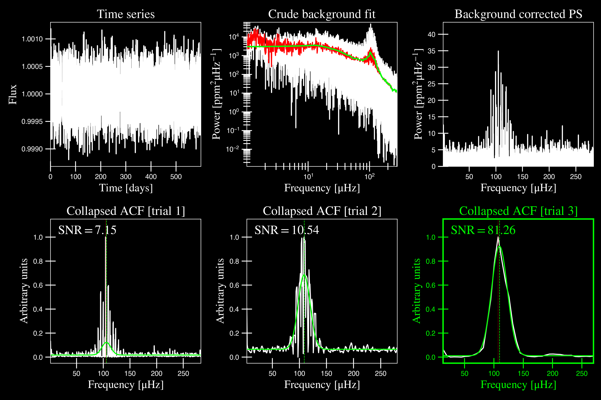
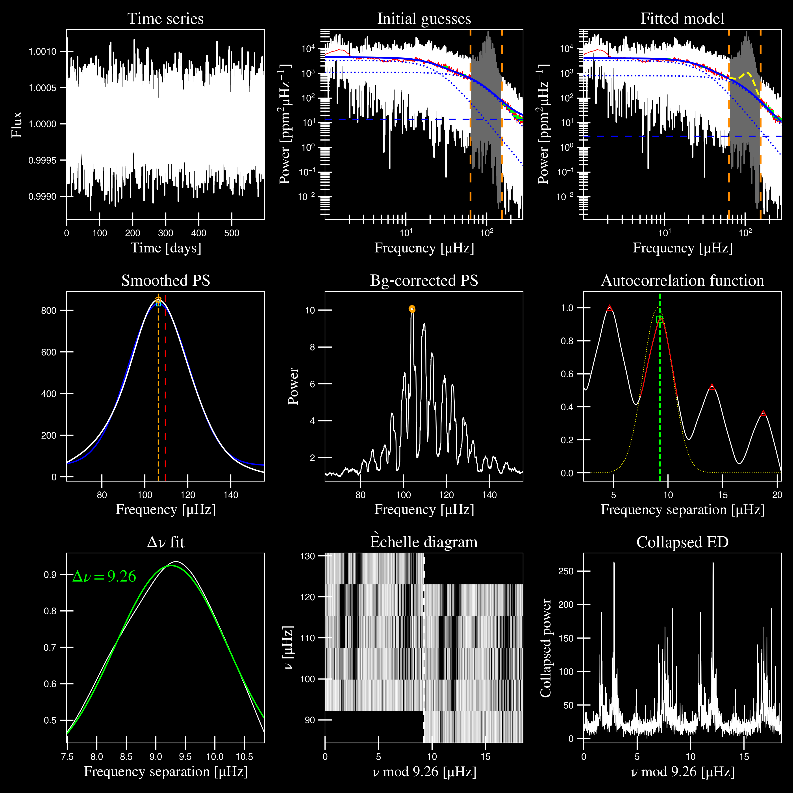
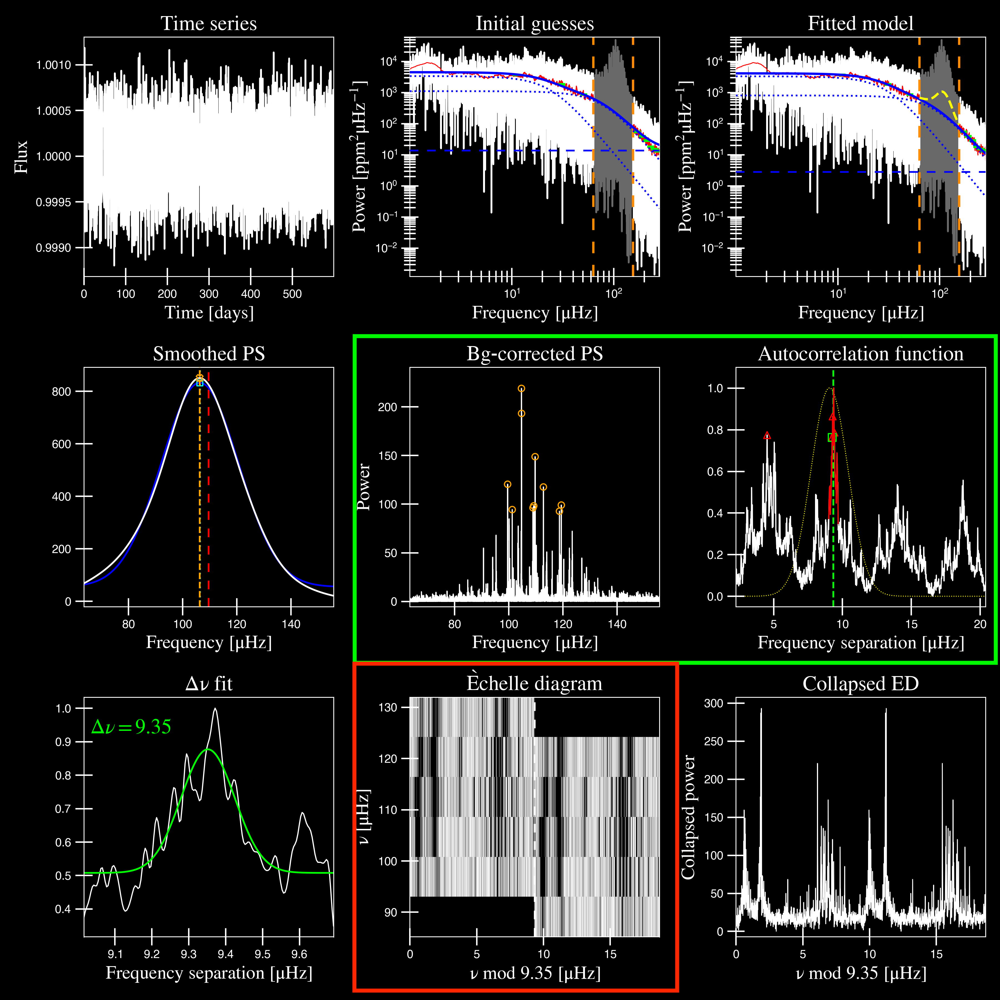
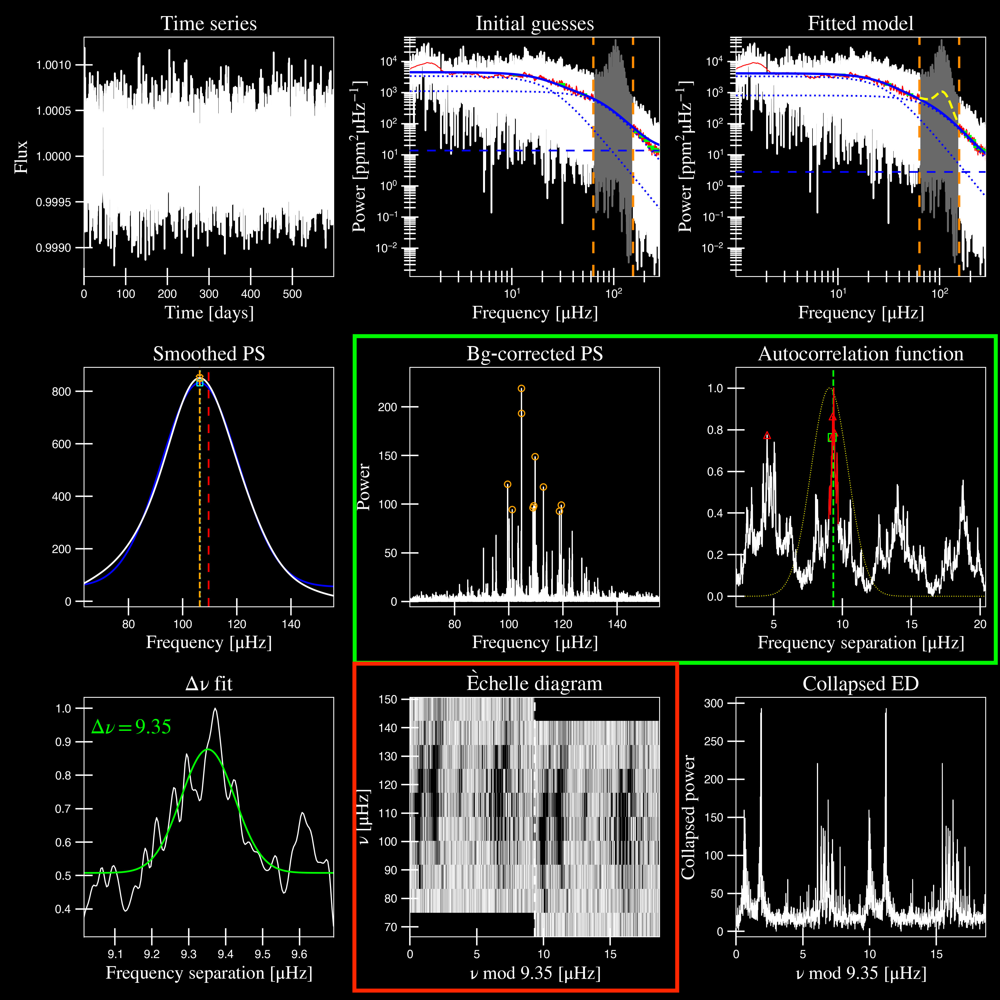
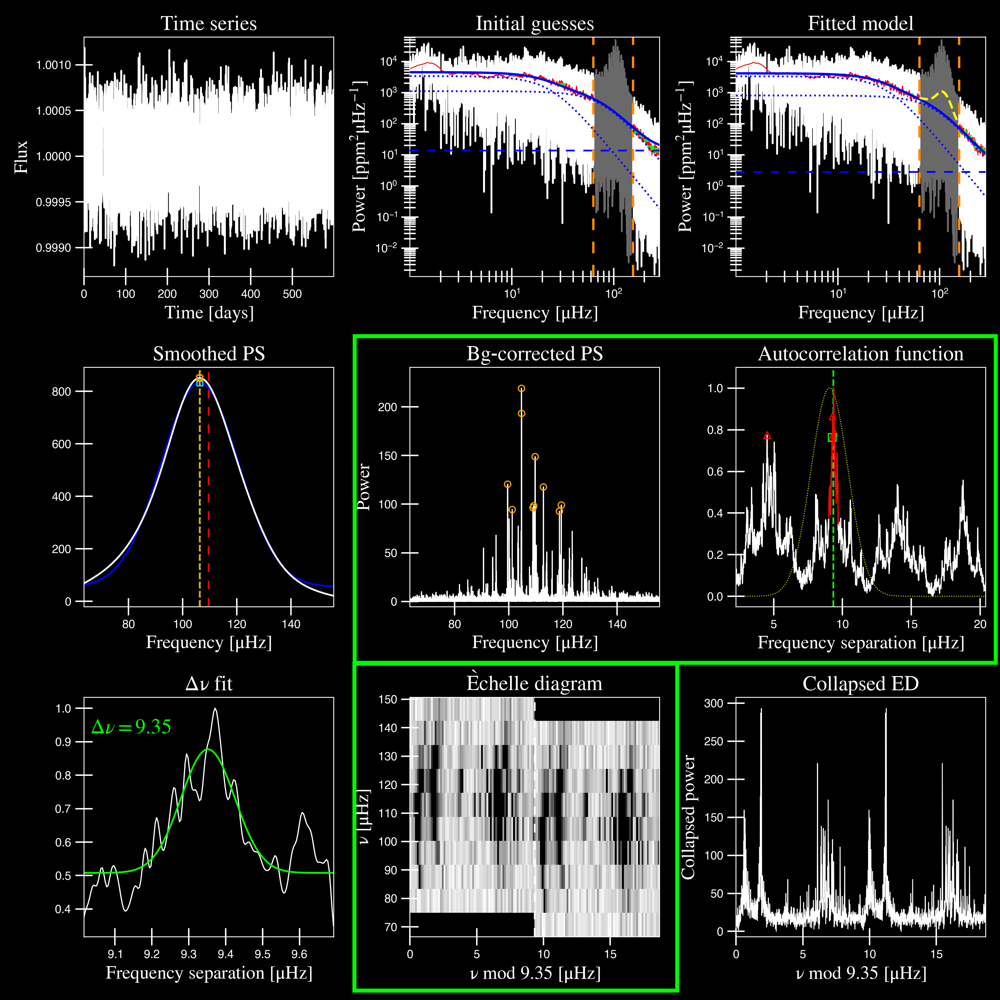

.. role:: bash(code)
   :language: bash

.. role:: underlined
   :class: underlined

.. _user-guide-examples:

This page has command-line examples for different usage scenarios, including several
customized single star applications as well as running an ensemble of stars using a 
single-line command. 

We also tried to include examples demonstrating different signal-to-noise detections,
including what to look for in each scenario. 

.. _user-guide-examples-single:

************************
Single star applications
************************

For applications to single stars, we will start with a very easy, high signal-to-noise (SNR)
example, followed by medium and low SNR examples as well as a null detection. These examples 
will not be as detailed as the :ref:`quickstart example <quickstart-script>` -- our goal 
here is to provide pointers on what to look for in each case. 

.. _user-guide-examples-single-high:

:underlined:`A fire detection`
####################################

KIC 11618103 is our most evolved example, an RGB star with numax of :math:`\rm \sim 100 \mu Hz`. We will 
now admit that while the default settings work for *most* stars, some of the defaults could/should (or 
even in some cases *need*) to be changed for more evolved stars like this example. 

It doesn't necessarily mean that it will get the answers wrong, but we will take you 
through a few different runs and change some of the settings with each run.

Run 1: `pysyd run --star 11618103 -dv`
**************************************

If we run it straight "out-of-the-box" with our usual command:

.. code-block::

   pysyd run --star 11618103 -dv

The autocorrelation function (or :term:`ACF`) in panel 6 looks very smooth - I'd
say almost a little *too* smooth. In fact if you look at the panel directly to the
left under "Bg-corrected PS", the power spectrum also looks a little strange, right?

This is because our smoothing filter (or box filter) has a default value of :math:`2.5 \mu Hz`,
which is quite high for this star. Typically a common value is :math:`1.0 \mu Hz`, if at all,
but usually much much less than our expected numax.

Run 2: `pysyd run --star 11618103 -dv --sp 0.0`
***********************************************

So for our first change, we are going to tone down the "smoothing" by setting it to
zero i.e. not smoothing it at all. We can see how that will affect the calculated ACF (again, panels 5+6). 

.. code-block::

   pysyd run --star 11618103 -dv --sp 0.0

Since we are not changing anything from the first part, we will leave out the first plot
for brevity.

As you can see above, the bg-corrected power spectrum and ACF both look more reasonable
now -- it didn't change the quality of the fit or our answer but it definitely looks
better. However, if you look at the echelle diagram (panel 8), it almost looks like we
aren't capturing all oscillation modes -- our ridges look cut off so let's plot more
bins on the y axis.

Run 3: `pysyd run --star 11618103 -dv --sp 0.0 --noy 9+0`
*********************************************************

We've tried to make the commands as obvious as possible to make it easier to digest.
For example, here we are changing the number of bins on the y axis (or :term:`--noy<--noy, --ndown, --norders>`--noy) 
of the echelle diagram, which is currently equal to 5 (also corresponds to 5 radial orders).

Let's change it to something higher.

.. code-block::

   pysyd run --star 11618103 -dv --sp 0.0 --noy 9+0

You'll see that we provided a keyword argument with a length of 3. The first digit
is the number of bins (or radial orders) to plot and the next two digits provide the
ability to shift the entire plot up/down by n orders as well! If 0 is provided as the
second part of this value, it will center it on our expected numax. FWIW: --noy 9-0
would plot exactly the same thing.

This looks a lot better and it looks like we are capturing all features in the new
y-axis range. Turns out we can also change the number of bins (or bin resolution)
on the x axis of the echelle diagram as well.

Run 4: `pysyd run --star 11618103 -dv --sp 0.0 --noy 9+0 --npb 35`
******************************************************************

Using basic logic, you can deduce that the relevant keyword argument here is indeed
:term:`--nox<--nox, --nacross>`. However, the number of bins on the x axis is more
arbitrary here and depends on a couple different things, primarily the spacing (or :math:`\Delta\nu`)
and the frequency resolution of the power spectrum.

Since changing the number of bins using --nox is somewhat arbitrary -- we've created 
an additional argument that calculates the number of points per bin or npb (:term:`--npb`).
Therefore this option uses information from both the spacing and the frequency resolution
to estimate a more relevant number to use on the x axis.

.. code-block::

   pysyd run --star 11618103 -dv --sp 0.0 --noy 9+0 --npb 35

But this is just the tip of the iceberg -- please see our complete 
:ref:`list of available options <user-guide-glossary>`!

-----

.. _user-guide-examples-single-medium:

:underlined:`A medium-to-mild detection`
########################################

We used this example for new users just getting started and therefore we will only show
the output and figures. Feel free to visit our crash course in asteroseismology, or 
:ref:`crashteroseismology <quickstart-crash>` page, which breaks down every step in great
detail. 

.. image:: ../_static/1435467/search_&_estimate_1.png
  :width: 680
  :alt: KIC 1435467 estimates

.. image:: ../_static/1435467/global_fit_1.png
  :width: 680
  :alt: KIC 1435467 global fit

.. image:: ../_static/1435467/samples_1.png
  :width: 680
  :alt: KIC 1435467 parameter posteriors

-----

.. _user-guide-examples-single-low:

:underlined:`Low SNR: KIC 8801316`
##################################

As if asteroseismology wasn't hard enough, let's make it even more difficult for you!

KIC 8801316 is a subgiant with a numax ~1100 muHz, shown in the figures below. 

.. image:: ../_static/8801316/search_&_estimate_1.png
  :width: 680
  :alt: KIC 8801316 estimates

.. image:: ../_static/8801316/global_fit_1.png
  :width: 680
  :alt: KIC 8801316 global fit

.. image:: ../_static/8801316/samples_1.png
  :width: 680
  :alt: KIC 8801316 parameter posteriors

This would be classified as a detection despite the low SNR due to the following reasons:

- there is a clear power excess as seen in panel 3
- the power excess has a Gaussian shape as seen in panel 5 corresponding to the solar-like oscillations
- the autocorrelation function (ACF) in panel 6 show periodic peaks
- the echelle diagram in panel 8 shows the ridges, albeit faintly

-----

.. _user-guide-examples-single-no:

:underlined:`No SNR: KIC 6278992`
#################################

KIC 6278992 is a main-sequence star with no solar-like oscillations.

.. image:: ../_static/6278992/search_&_estimate_1.png
  :width: 680
  :alt: KIC 6278992 estimates

.. image:: ../_static/6278992/global_fit_1.png
  :width: 680
  :alt: KIC 6278992 global fit

.. image:: ../_static/6278992/samples_1.png
  :width: 680
  :alt: KIC 6278992 parameter posteriors

-----

.. _user-guide-examples-multiple:

***********
Star sample
***********

Depending on how large your sample is, you may choose to do it one of two ways.

Regular mode
############

Since this is optimized for running many stars via command line, the star names will be read in 
and processed from `'info/todo.txt'` if nothing else is provided:

.. code-block::

    $ pysyd run

Parallel mode
#############

There is a parallel processing option included in the software, which is helpful for
running many stars. This can be accessed through the following command:

.. code-block::

    $ pysyd parallel 

For parallel processing, `pySYD` will divide and group the list of stars based on the 
available number of threads. By default, this value is `0` but can be specified via 
the command line. If it is *not* specified and you are running in parallel mode, 
``pySYD`` will use ``multiprocessing`` package to determine the number of CPUs 
available on the current operating system and then set the number of threads to this 
value (minus `1`).

If you'd like to take up less memory, you can easily specify the number of threads with
the :term:`--nthreads<--nt, --nthread, --nthreads>` command:

.. code-block::

    $ pysyd parallel --nthreads 10 --list path_to_star_list.txt
   
